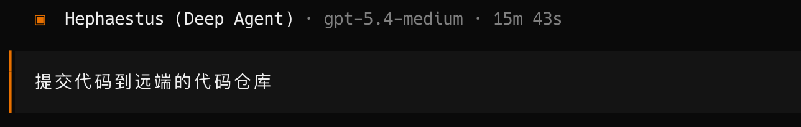

# agent开发实战讲解--几乎全vibecoding实战


## 以简单的texttosql为例，讲解一下当前这个代码应该如何使用

> 未来的你如何使用这份代码进行二开
>
> 2026年03月12日


### runtime-service 代码的开发案例讲解 


和终端对话如下，让agent先了解一下整个代码的架构

```
你熟悉掌握apps/runtime-service下的代码和使用方式，稍后我们在这份代码上开发新的服务，读完代码后，告诉我，你学到了什么
```


这里他会阅读代码，最后理解整个代码的框架是什么样的，主要在docs文档中有相关开发文档，他会结合这来熟悉整个代码架构


这里我们用一个小🌰，让agent开发一个texttosql的服务，并且最后可视化展示，为了方便，我直接给他一个langgraph 官方的链接 

https://docs.langchain.com/oss/python/langchain/sql-agent 


和AI对话如下：

```
你阅读一下这个文档： https://docs.langchain.com/oss/python/langchain/sql-agent   我想实现一下这样的一个需求 ，先和我讨论应该如何做，然后我们再实现代码
```


agent回复如下：


这里面大家要理解一下整体的代码架构，我们使用AI是为了提高我们的效率，如果什么都不明白，什么都交给AI，那后面做出的东西，会有大坑，我们应该和AI一起成长，这样才不会被淘汰，这是我个人的一点理解哈，大白话就是，拥抱AI，共同成长


整体你需要理解的东西，你都可以在docs中自己看文档，我代码尽量的没有写的那么复杂了，正常的语言功底都可以理解我这套代码，如果你不懂，还可以问AI


接下来我直接基于AI的回复继续深入讨论，把这个需求定下来


```
代码放在
apps/runtime-service/graph_src_v2/services/sql_agent/下面
对外注册使用langgraph.json
我们一期先实现用例SQLite的，而且直接使用提供给你的URL里面的sqlite，后面支持MySQL pg
不需要你考虑多租户
安全策略，只允许读权限

先给出一个README.md文档，告诉我接下来你如何设计


```


接下来我们需要详细的看下他的设计文档，和我们最初的想法是否有偏离


这里我还希望大家记住一个原则，慢就是快，在最开始的设计阶段，一定要一步一个脚印慢慢来


```
我们就以url = "https://storage.googleapis.com/benchmarks-artifacts/chinook/Chinook.db" 内置到代码里面，后期再考虑对外暴露能力：支持自定义MySQL pg等数据库

我们在加入一个可视化展示的mcp，这个写入到公共的mcp模块中
mcp_client = MultiServerMCPClient(
    {
        "mcp-server-chart": {
            "command": "npx",
            # Make sure to update to the full absolute path to your math_server.py file
            "args": ["-y", "@antv/mcp-server-chart"],
            "transport": "stdio",
        }
    }
)

其余你的方案没有问题
再次修改README.md 
也把这个mcp写入到代码中


```


agent


最后让AI直接编写代码，完成后总结


可以查看代码,这个过程我没有修改一次代码：


代码已经编写完毕，我们启动服务来验证一下，如果你不懂如何启动服务，你也可以这样问一下agent `如果我想亲自验证服务，通过和前端的直连的方式来，我应该如何启动呢？` 


这里我直接给出验证的命令，看下会不会报错

```
# langgraph 
cd apps/runtime-service/
uv run langgraph dev --config graph_src_v2/langgraph.json --port 8123 --no-browser


# web 端口
cd apps/runtime-web
uv run langgraph dev --config graph_src_v2/langgraph.json --port 8123 --no-browser
```

服务启动后：


我们需要知道graph是什么


前端输入后：


聊天对话：


```
每家公司的员工有多少人，进行汇总，给出图标来展示
```


看到这里，我发现一个问题，没有图表展示，现在我们看一下代码，是按照我的规范来完成开发，不过这里有一个问题，`if service_config.enable_chart_tools:` 这个需要为true是才能调用，因此agent本身没有加载生成图片的mcp


我们继续和agent对话来让他修复这个问题

```
现在修复 aget_mcp_server_chart_tools 的问题，当前默认为service_config.enable_chart_tools True才可以，当前，我想设计成，直接tools.append(xxxx) 这种

另外，在docs的相关设计规范中也再次重点说明 后续的mcp，除非特别指明，我们都采用tools.extend(xxxxx)的方式
```


我们再次验证一下


现在已经有了相关数据可视化工具了，我们


```
有多少艺术家，每个艺术家有多少作品，最后生成图标，让我更容易理解
```


到现在我们langgraph 这一层基本上开发完成了，框架我开发好了，你接入的时候，几乎可以不手敲一点代码完成agent智能体开发


我们把代码提交到远端




### runtime-web

这一层几乎不需要我们做什么开发，只是我们调试使用的


### platform-api 及 platform-web 开发

这一层我们做一个简单的


如果你要开发这部分代码，你可以先了解一下项目，这部分也是AI帮助你

```
熟悉掌握apps/platform-api 和apps/platform-web ,后面我们开始这部分的开发
```


在agent理解当前的代码架构下后，你只需要说，将刚才开发的SQL agent嵌入到当前页面中

```
将刚才开发的SQL agent嵌入到当前的页面，根据apps/platform-web中agent的开发的规范，使用chat页面的模板，重新生成一个页面供用户在前端使用，也在导航栏加入该SQL agent的标题
```


成果：

理论上你能看到，如果我们仅开发一个最简单的智能体，可能只需要把langgraph这一层做好，剩下的平台和前端基本上都可以无缝接入

当然，后面还会有一些复杂的场景开发，我会放在下一个案例进行说明


## 后面的你拿到这套代码如何二开

这次我以一个简单的案例做了讲解，从agents 到服务层最后又到前端  ， 理论的形成是总实践中不断总结出来的，我也把我的理论走过的路，又完整的给你描述了一番，希望对你有帮助


现在这里的texttosql是基于一个例子的，那么未来在公司内部，你就可以用真实的表进行二开 ，可以加入RAG 可以优化提示词  ，还是把这个agents变得更加通用，适配sqllite，MySQL ，pg等等数据库，核心思路还是你吃透我给出的这套代码（已经是最简单的框架，我几乎把所有复杂的python语法都去掉了，也没有进行过度的封装，希望这套代码也能帮你在coding和架构能力上更上一层楼）


