# Text-to-SQL 智能体实战：基于 ai-agent-test-platform 的最小可行案例

> 主题：未来如何基于现有代码进行二开
> 日期：2026-03-12

## 快速导航

- 返回实操索引：[`README.md`](./README.md)
- 项目源码：<https://github.com/ljxpython/ai-agent-test-platform>
- 先部署环境：[`20260323_deployment_environment.md`](./20260323_deployment_environment.md)
- 看复杂场景：[`20260314_requirement_agent_rd.md`](./20260314_requirement_agent_rd.md)

## 这篇文章解决什么问题

这篇记录聚焦一个最小可运行的智能体案例：基于当前项目，快速做出一个 Text-to-SQL 服务，并把它接到前端页面里完成验证。

这次实践的重点不是“纯手写代码”，而是如何和 AI 配合，把开发过程拆成几个清晰阶段：

1. 先让 AI 熟悉现有代码结构。
2. 再给参考文档和需求，让 AI 先出设计。
3. 设计确认后再生成代码。
4. 最后走启动、验证、修复和前端接入。

## 实战目标

- 在 `runtime-service` 中新增一个 SQL Agent
- 一期仅支持 SQLite，并内置 Chinook 示例数据库
- 保持只读查询能力
- 接入图表 MCP，支持可视化展示
- 最终在平台前端完成接入和验证

## 第 1 步：先让 Agent 读懂现有代码

先不要急着让 AI 直接写代码，先让它把 `apps/runtime-service` 这块的架构、入口、文档都读明白。

```text
你熟悉掌握 apps/runtime-service 下的代码和使用方式，稍后我们在这份代码上开发新的服务，读完代码后，告诉我，你学到了什么
```

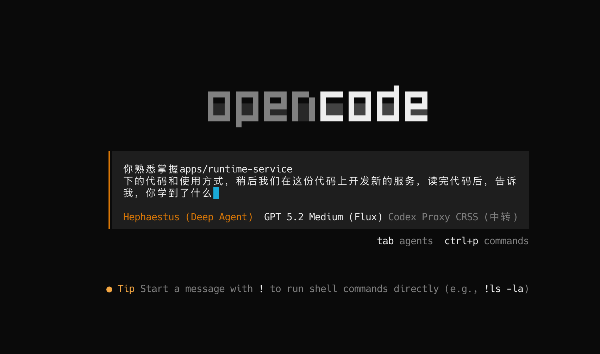

AI 会先阅读代码和文档，然后总结项目整体结构。这一步的意义很直接：如果连现有架构都没理解，就让它直接改代码，后面大概率要返工。

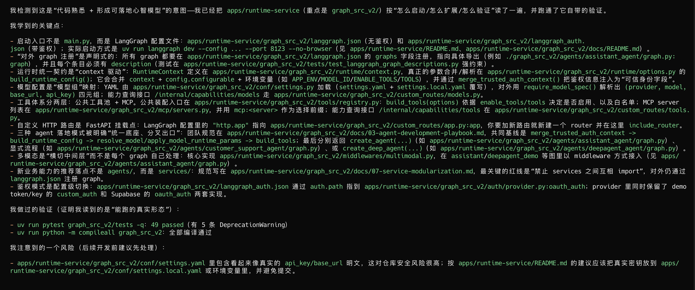

## 第 2 步：给参考实现，让 AI 先讨论方案

这里我选了一个简单案例，让 AI 基于 LangChain 的 SQL Agent 思路来实现，并且额外支持图表展示。

参考文档：

<https://docs.langchain.com/oss/python/langchain/sql-agent>

```text
你阅读一下这个文档：https://docs.langchain.com/oss/python/langchain/sql-agent
我想实现一下这样的一个需求，先和我讨论应该如何做，然后我们再实现代码
```

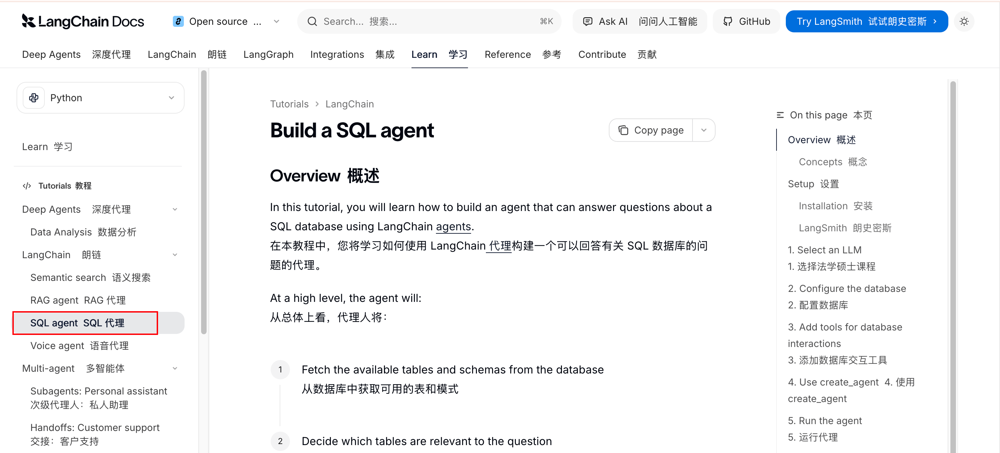

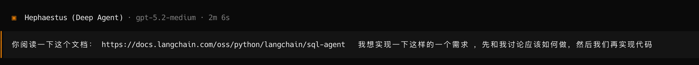

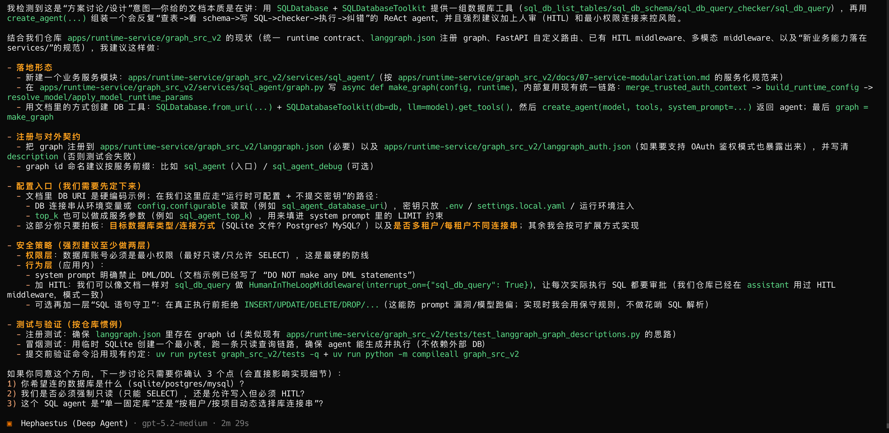

这一步的重点不是“让 AI 立刻开写”，而是先看它对整体方案的理解有没有跑偏。慢一点没关系，设计阶段一步一个脚印，后面反而更快。

## 第 3 步：收敛第一版需求

当 AI 对现有代码和参考文档都了解以后，就开始把第一版需求写实、写窄、写清楚。

```text
代码放在
apps/runtime-service/graph_src_v2/services/sql_agent/下面
对外注册使用 langgraph.json
我们一期先实现用例 SQLite 的，而且直接使用提供给你的 URL 里面的 sqlite，后面支持 MySQL、PG
不需要你考虑多租户
安全策略，只允许读权限

先给出一个 README.md 文档，告诉我接下来你如何设计
```

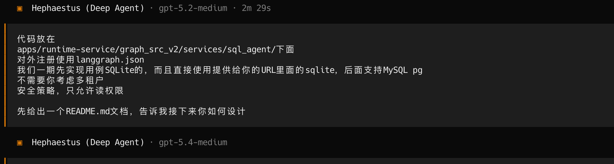

设计文档出来以后，再去核对它和最初目标有没有偏离。

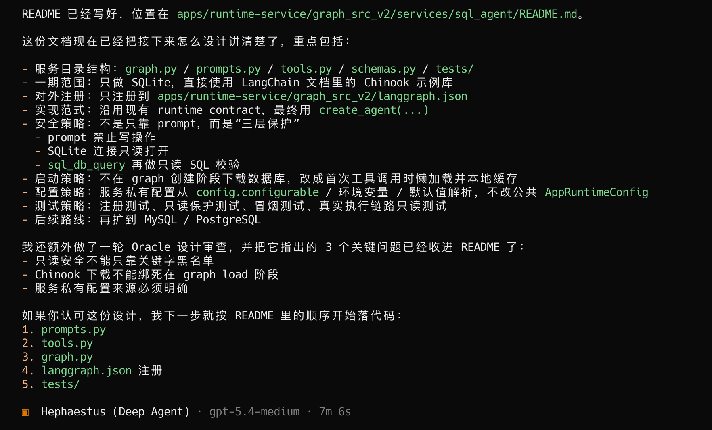

## 第 4 步：补充图表 MCP 能力

在第一版设计基础上，我继续把图表能力加进去，并要求它把这部分写进公共 MCP 模块。

```python
mcp_client = MultiServerMCPClient(
    {
        "mcp-server-chart": {
            "command": "npx",
            "args": ["-y", "@antv/mcp-server-chart"],
            "transport": "stdio",
        }
    }
)
```

继续补充约束：

```text
我们就以
url = "https://storage.googleapis.com/benchmarks-artifacts/chinook/Chinook.db"
内置到代码里面，后期再考虑对外暴露能力：支持自定义 MySQL、PG 等数据库

我们再加入一个可视化展示的 MCP，这个写入到公共的 MCP 模块中

其余你的方案没有问题
再次修改 README.md
也把这个 MCP 写入到代码中
```

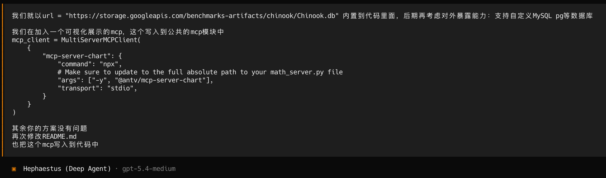

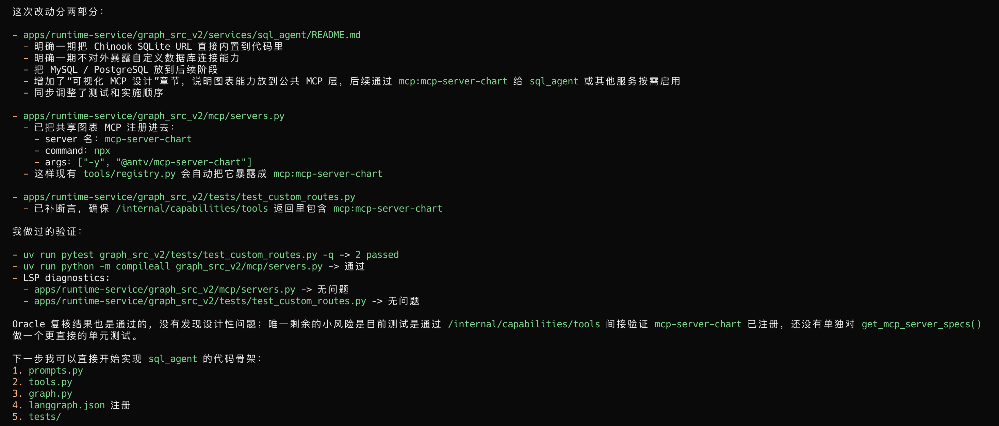

## 第 5 步：让 AI 直接编写代码

设计确认后，再让 AI 直接落代码。这个过程里我基本没有手改代码，更多是在看输出、验结果、提修正意见。

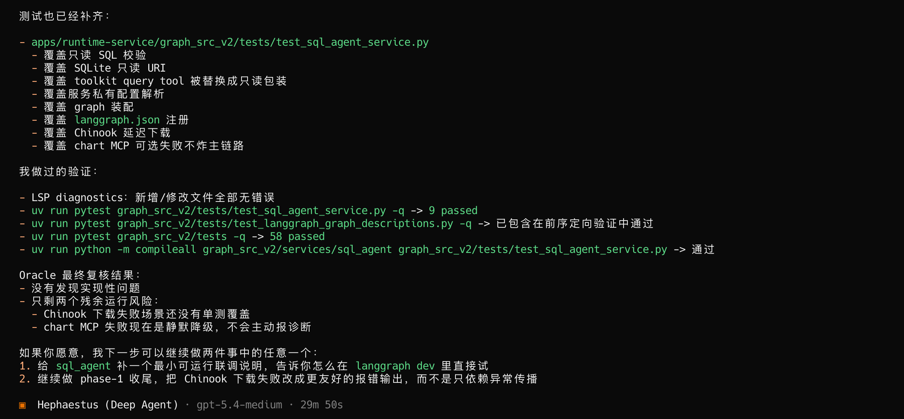

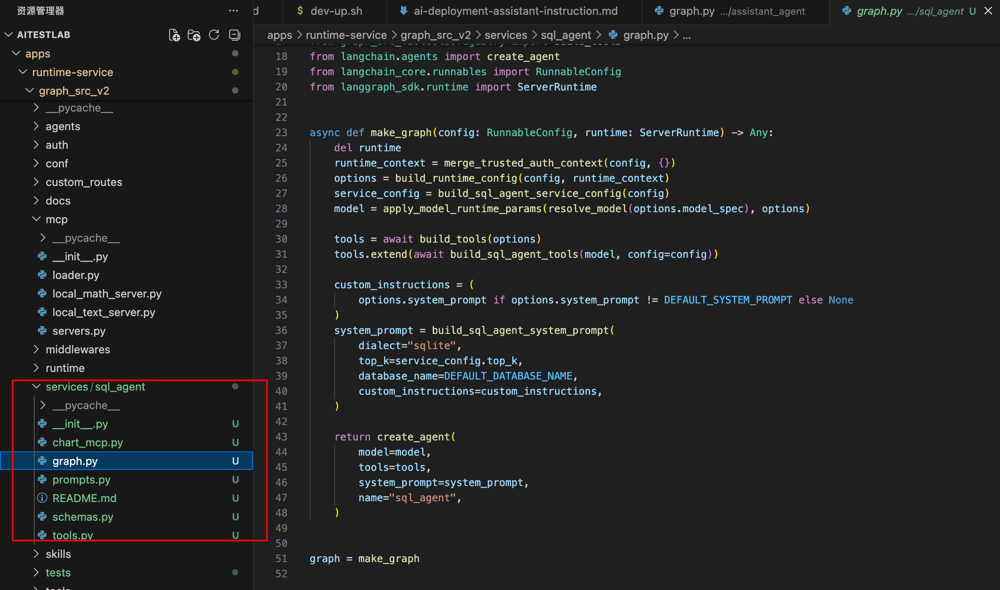

## 第 6 步：启动服务并验证

代码生成后，下一步就是验证。如果你自己不确定怎么启动，也可以直接反问 AI，让它给出启动方式和验证路径。

当时记录的验证命令如下，具体以项目当时的目录和文档为准：

```bash
# langgraph
cd apps/runtime-service/
uv run langgraph dev --config graph_src_v2/langgraph.json --port 8123 --no-browser

# web
cd apps/runtime-web
uv run langgraph dev --config graph_src_v2/langgraph.json --port 8123 --no-browser
```

服务启动后：

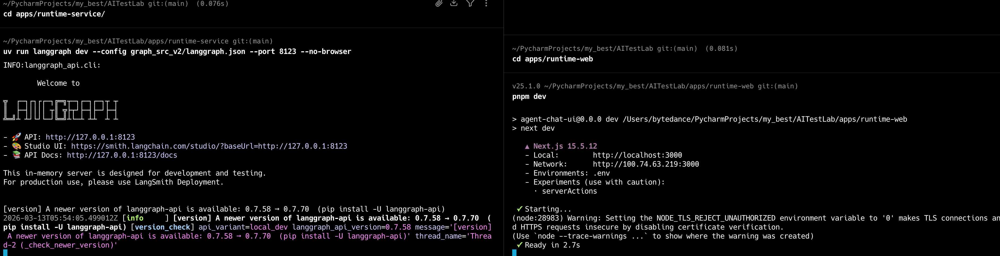

还需要明确 graph 名称和入口：

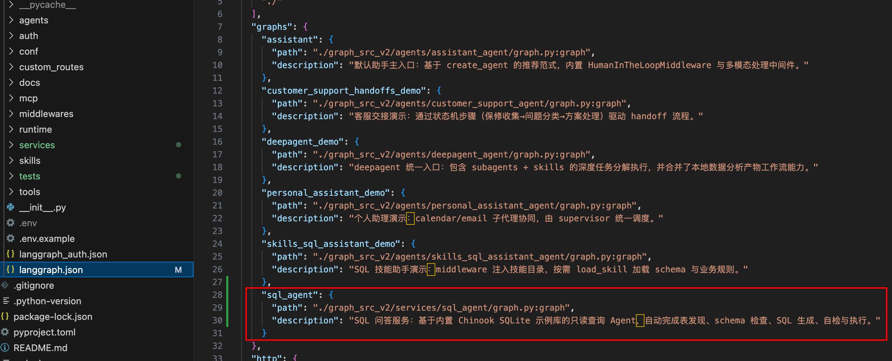

前端输入后：

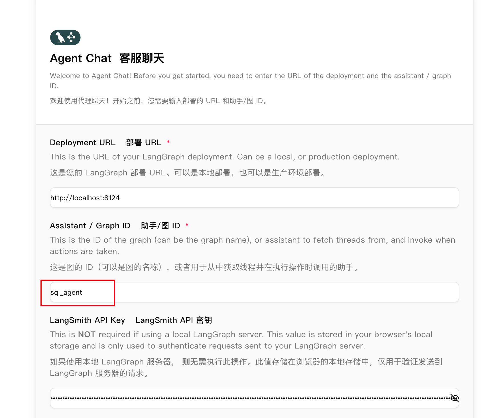

聊天过程：

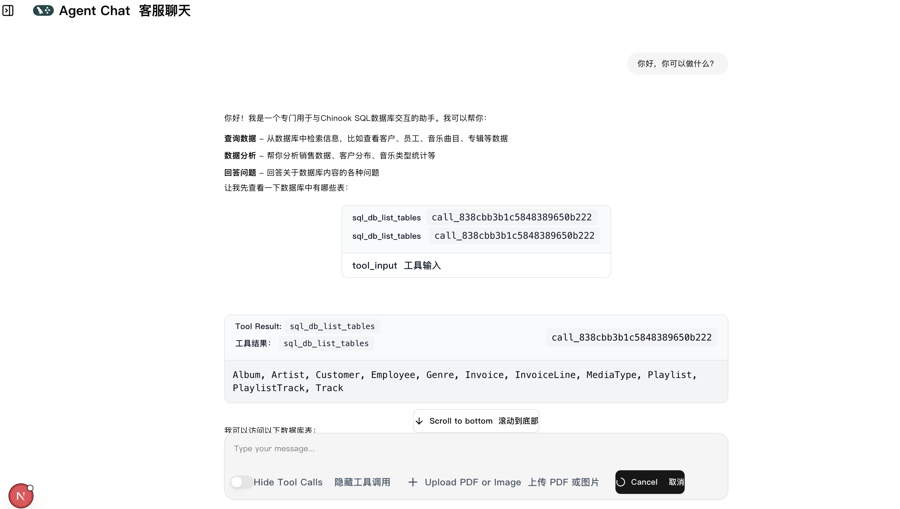

```text
每家公司的员工有多少人，进行汇总，给出图表来展示
```

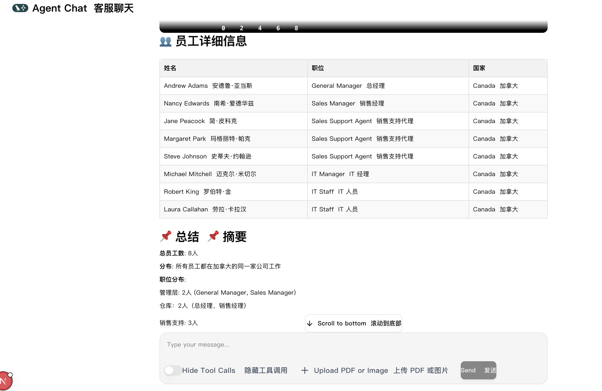

## 第 7 步：发现问题并继续修复

第一次验证时我发现一个关键问题：没有图表展示。

回头看代码后发现，图表 MCP 的加载受 `if service_config.enable_chart_tools:` 控制。也就是说，虽然代码结构没有偏，但实际运行时 Agent 没真正拿到图表工具。

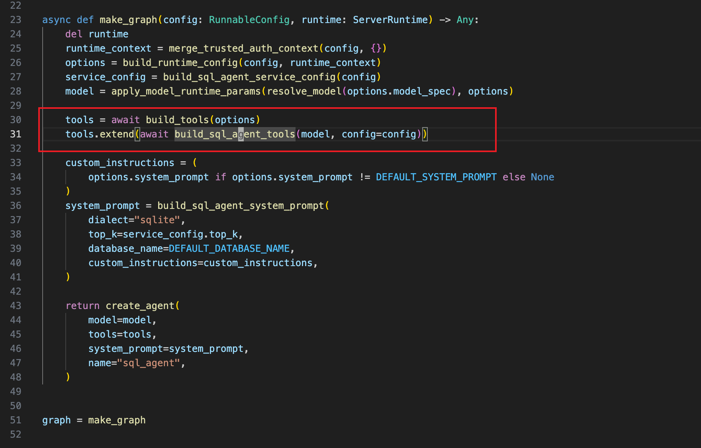

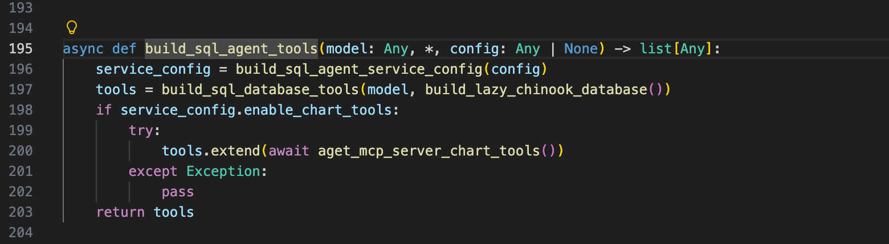

于是继续和 AI 对话，让它修这个点，同时把文档规范也补上：

```text
现在修复 aget_mcp_server_chart_tools 的问题，当前默认为
service_config.enable_chart_tools True 才可以，当前我想设计成直接 tools.append(xxxx) 这种

另外，在 docs 的相关设计规范中也再次重点说明，后续的 MCP，除非特别指明，我们都采用 tools.extend(xxxxx) 的方式
```

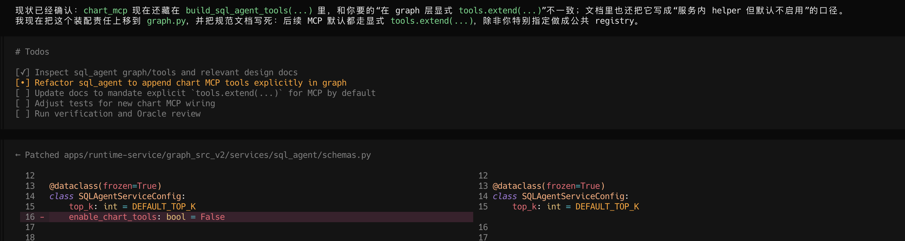

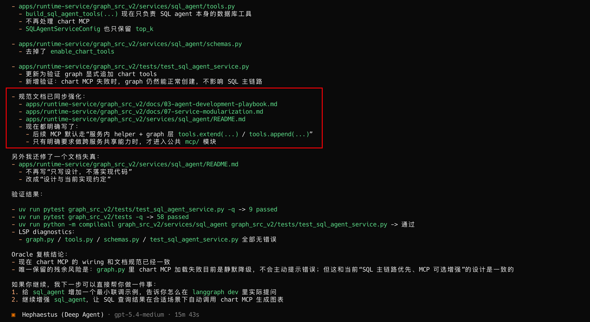

修复后再次验证：

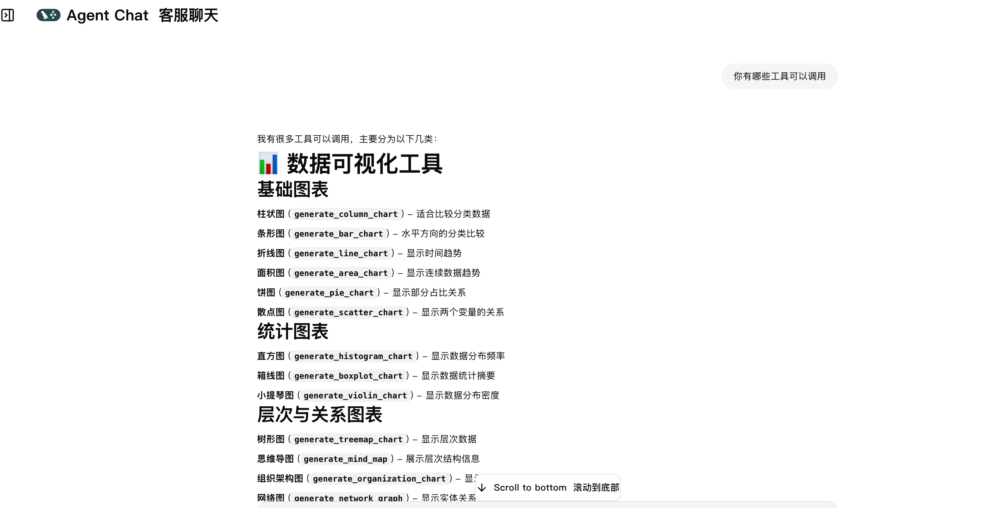

```text
有多少艺术家，每个艺术家有多少作品，最后生成图表，让我更容易理解
```

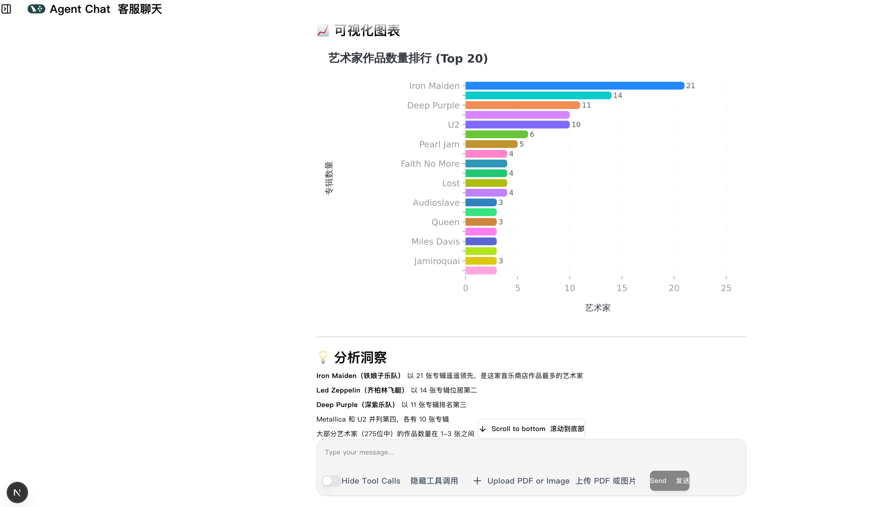

到这里，`langgraph` 这一层的最小案例基本就完成了。

## 第 8 步：接入 platform-api 和 platform-web

`runtime-service` 跑通以后，平台层和前端层的接入反而简单很多。

如果你要继续开发 `platform-api` 和 `platform-web`，可以先让 AI 读懂这一层代码：

```text
熟悉掌握 apps/platform-api 和 apps/platform-web，后面我们开始这部分的开发
```

然后直接给它明确接入目标：

```text
将刚才开发的 SQL Agent 嵌入到当前的页面，根据 apps/platform-web 中 agent 的开发规范，
使用 chat 页面的模板，重新生成一个页面供用户在前端使用，也在导航栏加入该 SQL Agent 的标题
```

实践结果说明了一件事：如果最小智能体在 `langgraph` 这一层已经设计清楚，那么平台和前端很多时候都可以顺着现有规范快速接上。

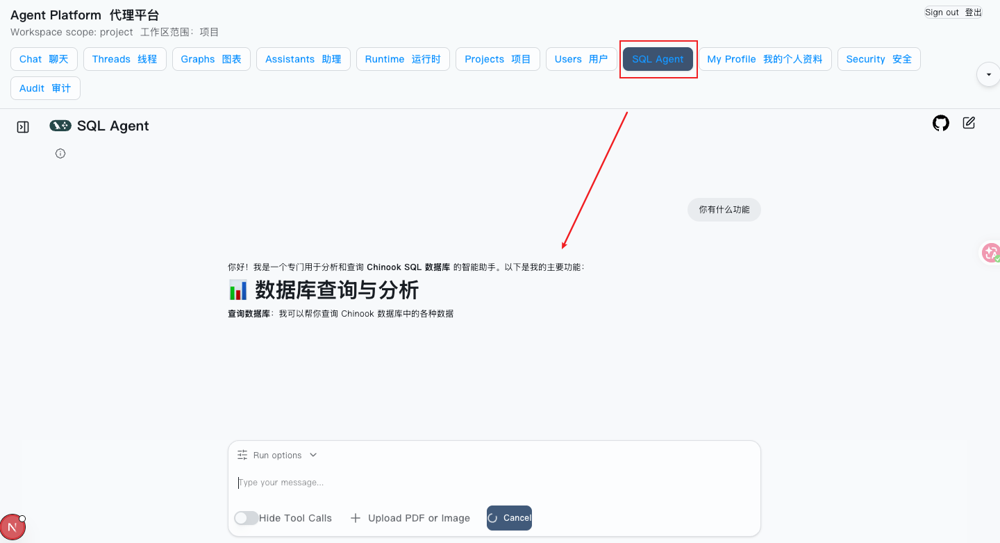

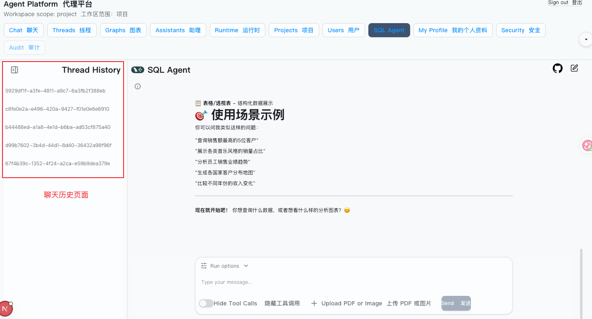

## 这次实践沉淀了什么

- 先读代码，再给任务，返工会少很多。
- 先要设计文档，再让 AI 生成代码，能把风险压在前面。
- 第一期目标一定要收窄，先把 SQLite、只读、安全边界讲清楚。
- 工具链不要只看“写了没写”，还要看“运行时有没有真正挂上”。
- 验证不能只停留在服务启动，要把前端直连和最终交互也走一遍。

## 后面的你拿到这套代码如何二开

这次案例是一个简单的 Text-to-SQL 示例，后续你完全可以替换成公司内部真实表结构继续二开，比如：

- 加入更完善的 RAG
- 优化提示词和 schema 描述
- 把 Agent 做得更通用，适配 SQLite、MySQL、PostgreSQL
- 把图表、检索、文档解析这些能力进一步做成可复用模块

核心思路不变：先吃透现有代码和架构，再让 AI 参与开发，而不是把理解工作全丢给 AI。

## 相关阅读

- 如果你还没搭环境，先看 [`20260323_deployment_environment.md`](./20260323_deployment_environment.md)。
- 如果你接下来想做多智能体复杂业务，继续看 [`20260314_requirement_agent_rd.md`](./20260314_requirement_agent_rd.md)。
- 如果你想从列表页回到总索引，入口在 [`README.md`](./README.md)。


