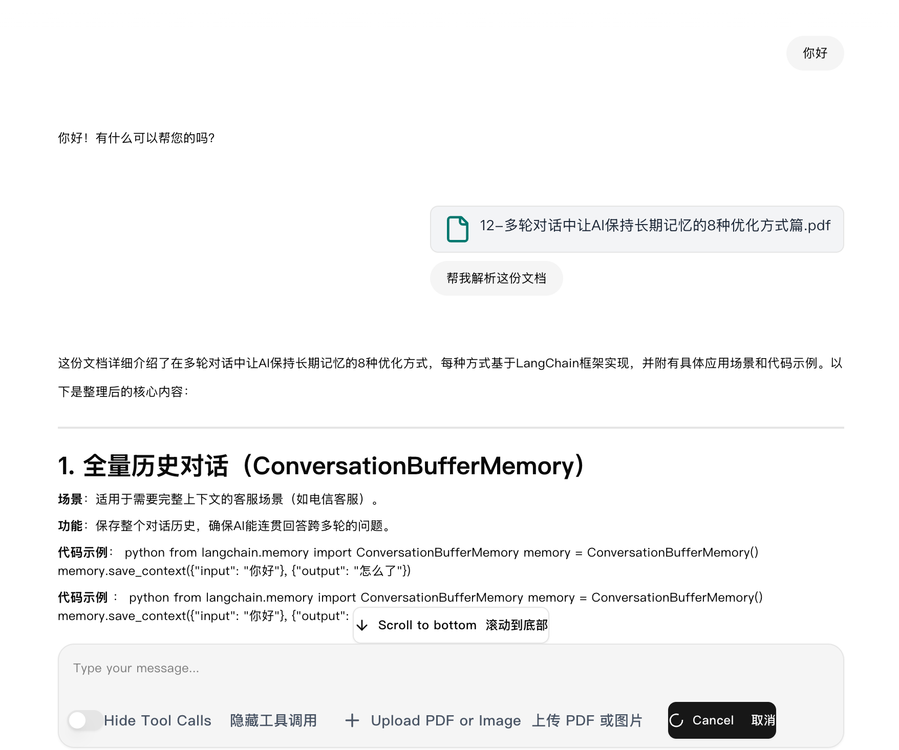

# 复杂场景下agent开发实战讲解--基于当前项目的vibecoding实战


## 以需求分析智能体为例，讲解一下当前这个代码应该如何使用

>  未来的你如何使用这份代码进行二开
>
> 2026年03月14日


### runtime-service中多agent代码的开发案例讲解

~~这里简单的说一下deepagent，可以查看langgraph的官方文档，https://docs.langchain.com/oss/python/deepagents/overview  可以把他比作`creat_agent`的升级版本，加了很多中间件，也至此沙箱和文件系统的操作~~

需求分析智能体可以使用create_agent智能体完成，但后面如果加入RAG和一些其他的系统的时候，使用deepagent的效果应该是最好的，这个后面在做

本期做的内容应该比较简单，在前端我可以上传一个文件，然后，智能体会把这个文件进行解析，后面的话就是加入一些rag。然后这个rag会同步的检索一些业务相关的知识，也一起给到智能体。当然，我们本期先不做rag，你不用着急，后期需要rug时，做成MCP，再接入ragent智能体就好了，这里给你提供这样一种非常便捷的方式。接着说这个需求，在初步分析之后，我们会将里面的知识点进行结构化的解析，然后还会有一个需求评审的智能体，这是一个子智能体这个子智能体的作用就是对我们的用例进行分析，然后总结其中不足的地方，让需求分析智能体修改


```
我们以一个真实的案例来设计完善这块，我希望开发一个用例生成智能体，前端可以上传需求文档，然后一个creat_agent下面有一个需求分析智能体和用例评审智能体还有一个数据落库的智能体，或者你看下这块应该如何实现，我想要实现的是，需求转化为用例，需要评审按照规范，把不符合或者欠缺的部分不足，最后落库到智能体，这中间最后一步到落库前，我们要看下用例是什么也可以给出建议，要再次修改，知道我们确认没有问题的时候落库到智能体，然后前端的话，一个正常的对话页面和用例界面，用例界面可以增删改查，我们把这个需求整体完成，你看下每一部分我们都应该如何设计
```


agent会思考接下里应该如何做


我会真实的跟你讲，当前的这个智能体还是一个比较简单的demo，但是智能体开发的思想都在这个里面，那需要优化的地方，其实就是解析文档，在真实的工作过程中，解析文档不只是这么简单，会遇到很多种格式，比如PDF、图片、word文档，比如说excel，在这些文档里面，有些只是文字，有些是比较多的表格，有些是比较多的图片，如果想要把它们一一的解析的比较准确，那么它的的背后是一个巨大的工程，关于这个，其实是可以专门来写一个服务的，然后把它集成为一个MCP，但是当前我只使用了langchain的一个集成库，所以当你遇到比较复杂的文档还是不可以的，而且仅仅是一个文档在业务上应该还不够吧，那我还需要业务的相关知识，这就需要rag技术了还有一点就是当前的代码逻辑上还需要更加清晰一点这些我毫不避讳地说，都是你未来可以优化的点。当前我给你的是一套开发智能体的通用方式，但在细节上，我需要你慢慢的自己来调整优化代码，这部分我没有直接给出答案，是因为我希望你在这个过程中自己了解一下代码，自己成长起来

而且，后面我感觉在用例分析这块没有必要做成前端对话的形式。因为我们上传文档解析文档的过程比较长，再加上一些rag的服务，可能会自定义一些内容，那么我们可以做成一个后台任务，也就是说这部分等待智能体完成，然后我们直接查看测试用例。在这个过程中，可以根据它的用例给他一定的反馈，让他二次生成优化和改进，然后最终落库。这样的一个效果，我认为其实是更加优秀的，现在做成前端这种形式，是方便你更加容易理解智能体协作的每一个步骤都是什么样的


效果：

ps： 这是一个复杂的工程，因此agent不能一次明白你要做的需求是什么，在我本次的测试过程中，我和AI对话了不下10轮，不断的调整需求，修复问题，验证问题，但是，这个过程，我尽可能不手动修改一份代码，只是分析代码，排查问题，然后告诉AI我的看法，在未来，随着AI不断的智能化发展，它会越来越清晰的理解我们的需求，我们要提升的就是我们的架构能力，需求的理解能力，还有一颗想要做事情的心


可以直接在对话中输入文本


## 总结

相关的方法我们在上一篇文章里面已经有介绍了，因此今天我们就把一些过程略过，主要看下效果，这个过程几乎不需要你手敲任何一段代码，但是需要你了解langgraph 比如他agent  graph  对话，终断  人机交互这些基本的知识，python的基础语法都有了解  然后阅读我docs下面的文档，明白我每一部分设计了什么了，我认为也希望，这将对你有巨大的提升


