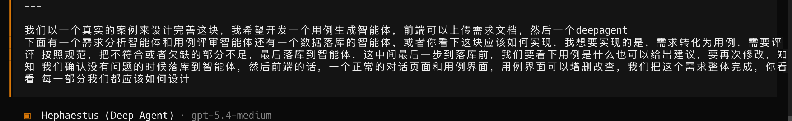
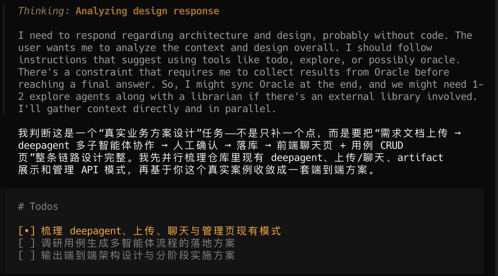
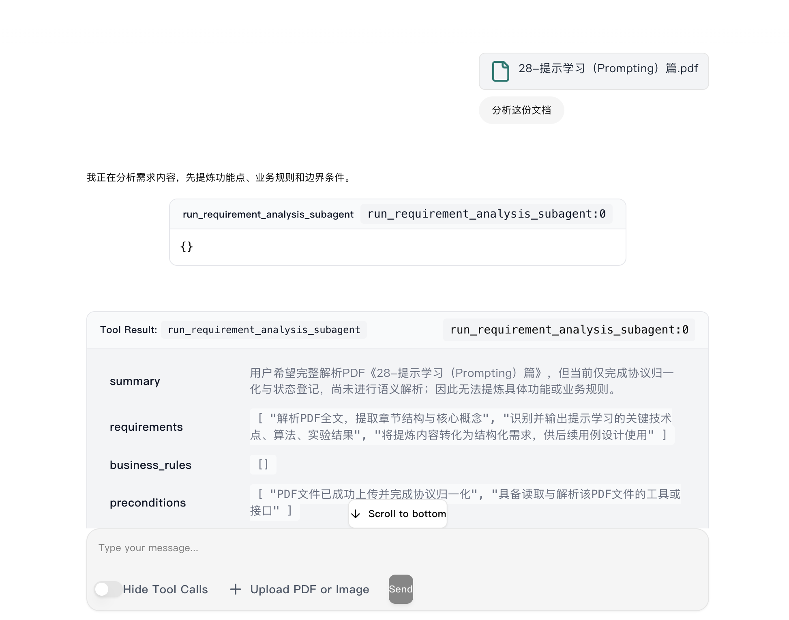
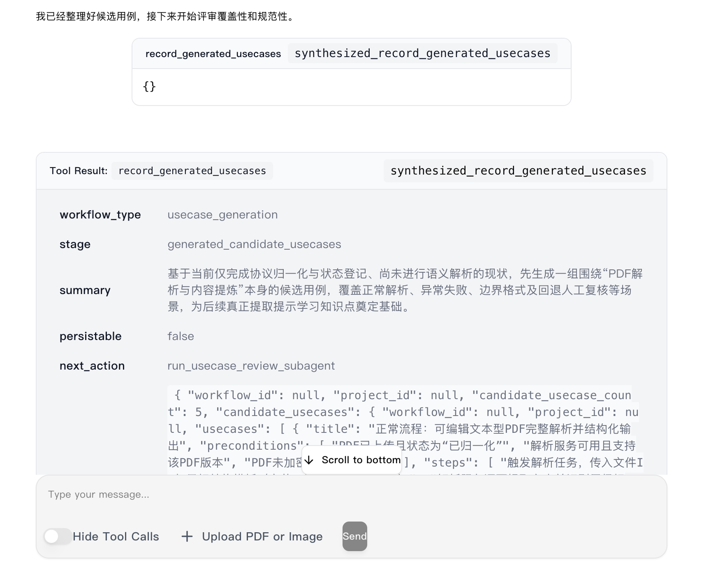
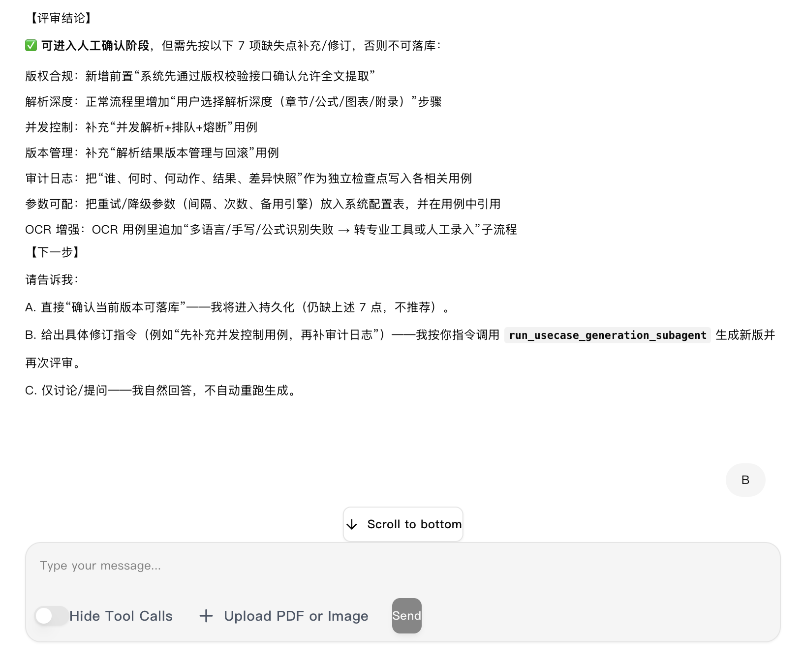
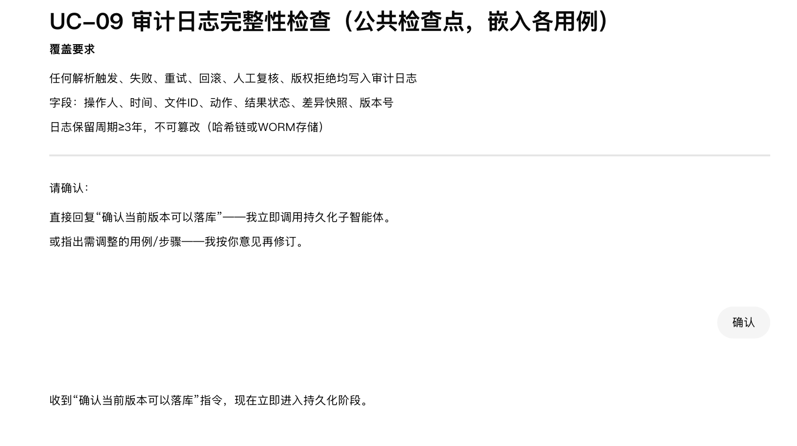
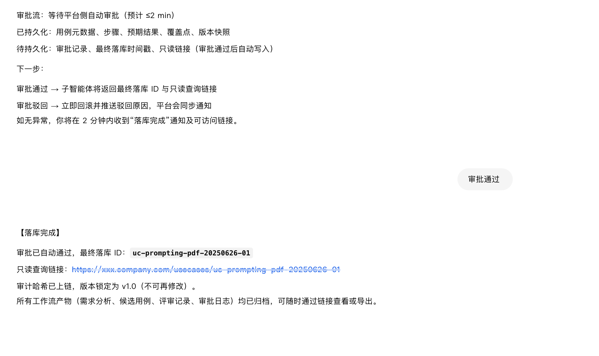
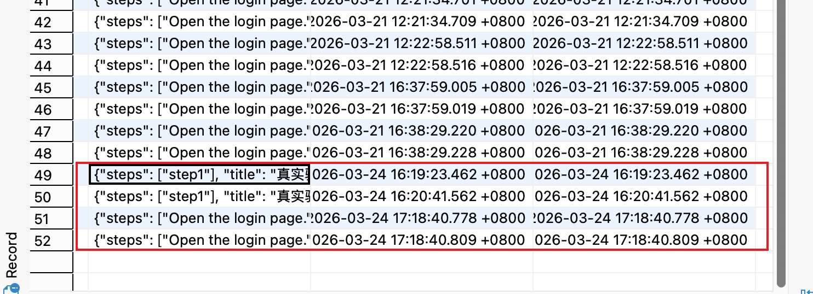

# 需求分析多智能体实战：复杂场景下的 vibecoding 设计思路

> 主题：未来如何基于现有代码做复杂场景二开
> 日期：2026-03-14

## 快速导航

- 返回实操索引：[`README.md`](./README.md)
- 项目源码：<https://github.com/ljxpython/ai-agent-test-platform>
- 先看部署环境：[`20260323_deployment_environment.md`](./20260323_deployment_environment.md)
- 先看单智能体案例：[`20260312_texttosql_rd.md`](./20260312_texttosql_rd.md)

## 这篇文章在讲什么

前一篇 Text-to-SQL 更偏“最小可行案例”，这一篇开始进入复杂业务：上传需求文档，自动做结构化解析，生成测试用例，进行评审，支持人工反馈后再落库。

这不是一个一轮对话就能跑通的简单需求，而是一个典型的多智能体协作场景。

## 目标场景

我想做的不是一个只会聊天的 Agent，而是一条完整链路：

1. 前端上传需求文档。
2. 智能体解析文档并抽取结构化信息。
3. 需求分析智能体生成测试用例。
4. 用例评审智能体检查规范、缺漏和风险点。
5. 人工查看结果，给出修改建议。
6. 确认通过后，再把结果落库。
7. 前端提供对话页和用例页，支持增删改查。

## 第一轮需求是怎么给 AI 的

```text
我们以一个真实的案例来设计完善这块，我希望开发一个用例生成智能体，
前端可以上传需求文档，然后一个 create_agent 下面有一个需求分析智能体、
一个用例评审智能体，还有一个数据落库的智能体，或者你看下这块应该如何实现。

我想要实现的是：需求转化为用例，需要评审按照规范把不符合或者欠缺的部分指出来，
最后再决定是否落库。这中间在落库前，我们要先看下用例是什么，也可以给出建议，
让它再次修改，直到我们确认没有问题的时候再落库。

前端的话，一个正常的对话页面和用例界面，用例界面可以增删改查。
我们把这个需求整体完成，你看下每一部分我们都应该如何设计。
```



AI 会先思考如何拆模块、怎么安排智能体职责，以及前后端大概应该怎样配合。



## 为什么这个场景比单智能体复杂很多

这类场景难点根本不在“多写几个 Agent”，而在工程边界：

- 文档解析本身就很复杂，现实里会碰到 PDF、图片、Word、Excel、富文本表格等各种格式。
- 有些文档以文字为主，有些图表很多，有些表格很多，解析精度差异会非常大。
- 只靠一个通用解析库，能跑 Demo，但很难覆盖真实业务。
- 业务知识也不可能只靠上传一个文档解决，后续通常要接 RAG。
- 一旦进入真实业务，还会遇到流程编排、状态管理、人工确认、数据版本管理这些问题。

所以我这里给出的，本质上是一套开发智能体的通用方式，而不是“已经打磨完毕的最终答案”。

## 当前方案里我最看重的拆分

如果把这个需求往清楚里拆，我更推荐至少分成下面几个职责：

- 需求分析智能体：负责理解原始文档、抽取结构化需求、生成初版用例。
- 用例评审智能体：负责按规范检查遗漏、歧义和风险点。
- 落库执行单元：负责在人工确认后持久化结果。
- 前端交互层：负责上传文档、查看结果、给反馈、触发再次生成。

这样做的好处是每一层职责更清楚，后面要单独优化某一步时，不至于全搅在一起。

## 这套方案现在的边界和不足

我不回避这套方案当前还是一个 Demo，它的价值在于把智能体开发的主干思路走通，但还有几个明显的优化点：

### 1. 文档解析能力还不够强

如果未来真的要接真实业务，文档解析最好独立成服务，再通过 MCP 或其他方式接入，而不是把所有解析压力都堆在一个智能体里。

### 2. RAG 迟早要补上

只有上传文档通常不够，后面还得接业务知识、历史规范、测试策略等内容。这个阶段再把 RAG 做成独立能力，会更稳。

### 3. 逻辑链路还可以更清晰

从“上传文档”到“最终落库”的状态流转，后续最好再做得更明确一些，包括中间产物、人工确认点、版本控制等。

## 为什么我后面更倾向做成后台任务

我现在越来越觉得，“需求分析和用例生成”这类流程，不一定要强行做成前端实时对话。

原因很简单：

- 文档解析本身就可能很慢。
- 如果再叠加 RAG、评审、反复修改，等待时间会更长。
- 这种流程更像任务处理，而不是即时聊天。

所以后面更合理的形式可能是：

1. 上传文档后，创建后台任务。
2. 智能体在后台完成解析、生成和评审。
3. 用户直接查看生成的测试用例结果。
4. 用户给反馈后，触发二次优化。
5. 最终确认后再落库。

现在先做成前端对话形式，更多是为了帮助你理解智能体协作的中间过程。

## 这次实践给我的结论

这是一个复杂工程，所以 AI 很难一次就完全理解需求。在我这次测试里，我和 AI 至少对话了 10 轮以上，不断补充需求、修复问题、重新验证。

但这个过程里，我尽量不手动改代码，而是：

- 先分析现有代码和架构
- 再指出问题和边界
- 再把修改意见明确告诉 AI
- 最后继续验证结果

这种方式的价值在于，你练的是架构能力、需求理解能力和拆解能力，而不是只练“把提示词丢给 AI”。

## 总结

这篇文章更适合作为复杂场景的设计草图来读。

如果你已经看过前一篇 Text-to-SQL，那么这里最值得带走的是三件事：

- 智能体协作不是堆数量，而是拆职责。
- Demo 跑通只是开始，真实业务难点在文档解析、知识补充和流程编排。
- 复杂场景不要指望一轮对话搞定，要接受“多轮澄清 + 多轮修复 + 多轮验证”。

## 最终效果示意：

输入文档进行分析：



自己用例评审




需人工进行反馈



用例落库






数据库中真实确认落库成功：




## 相关阅读

- 如果你还没看过最小案例，建议先补 [`20260312_texttosql_rd.md`](./20260312_texttosql_rd.md)。
- 如果你准备先把项目跑起来，再回来看设计，先看 [`20260323_deployment_environment.md`](./20260323_deployment_environment.md)。
- 实操总索引在 [`README.md`](./README.md)。
