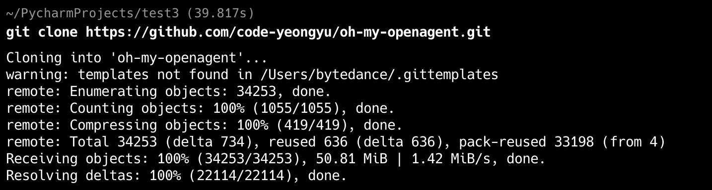
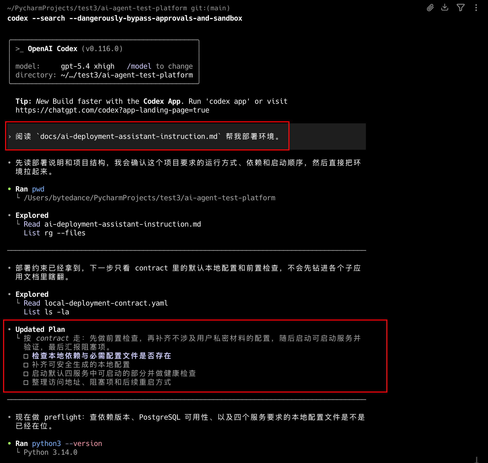
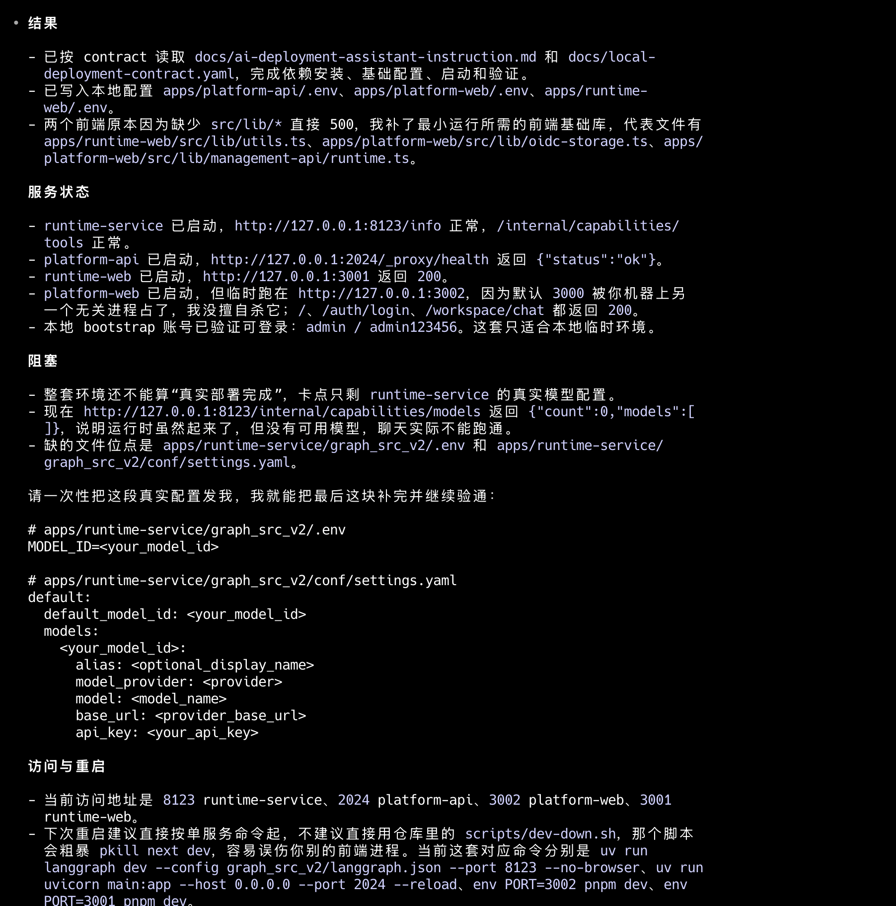
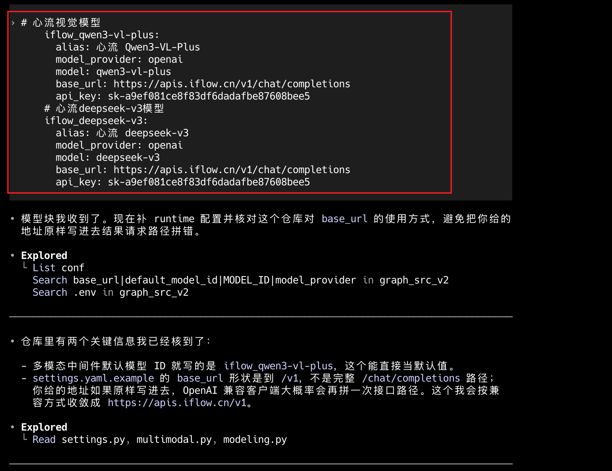
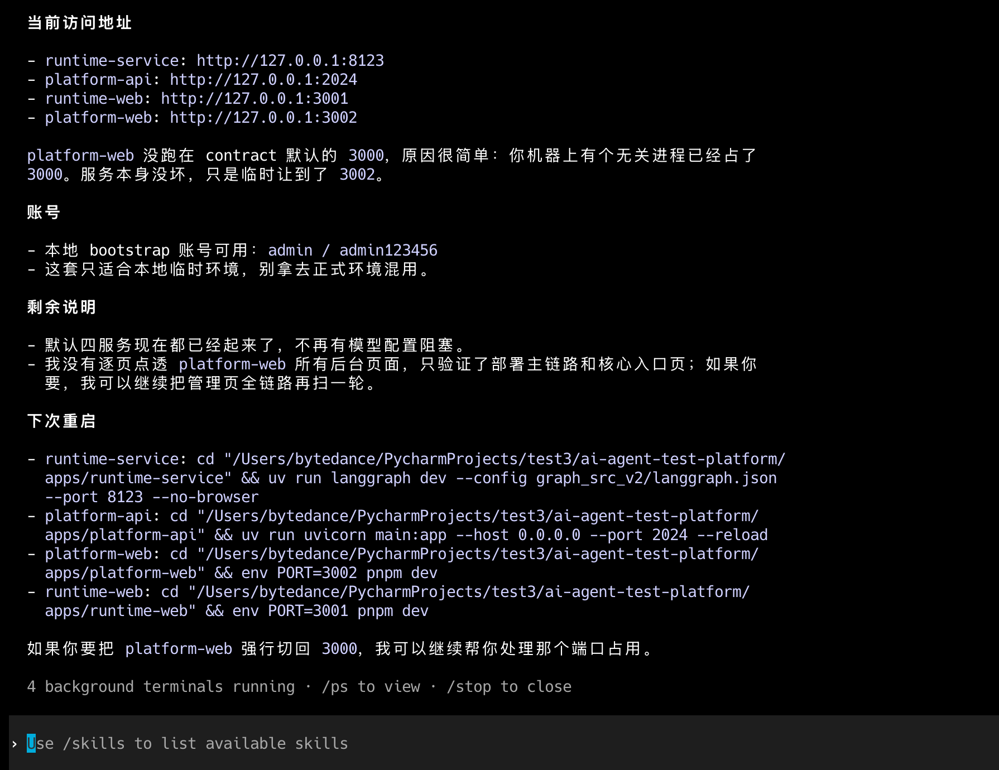
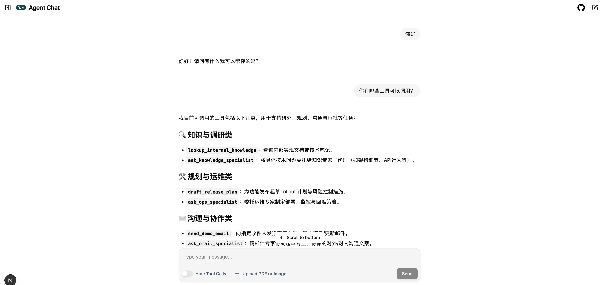
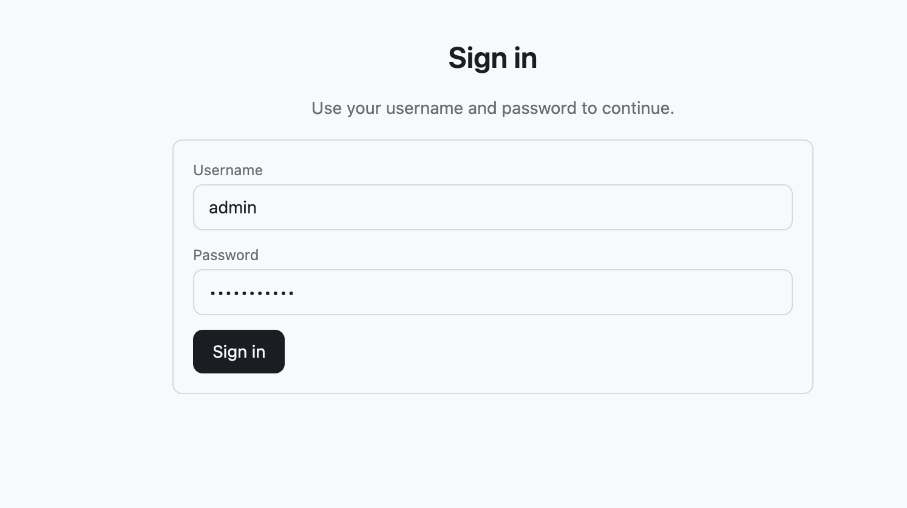
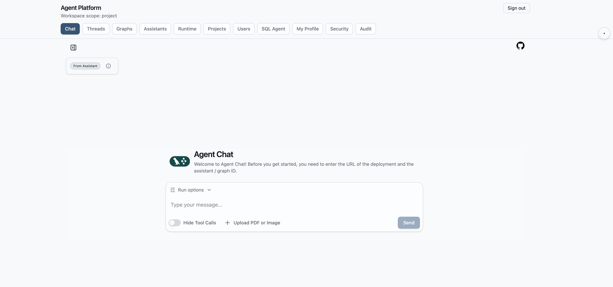
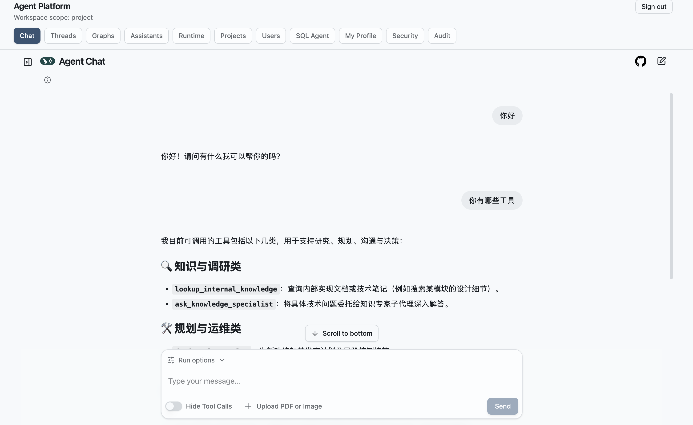

# ai-agent-test-platform 项目使用AI助手部署的方式介绍


## 思路

我希望`ai-agent-test-platform`这个项目，更多的是给你提供思路和参考，你也可以在这个基础上进行二次开发和封装，当前的这种架构是我经过多种架构比对下，我认为最佳的开发范式了


同样，部署环境这块，我也希望你能学习这种AI提效的方式，把常用的，复杂度低，可重复的工作，模板化，编排成AI能理解的工作流，这样就不需要每次我们都手动部署环境或者一些类似的工作

就比如当前的这个工作，如果正常部署，从数据库到前端到后端，到各个环节配置及验证，大概需要半天的时间（这还是熟悉当前项目的情况下），对于刚接触这个项目的新手来说，要理解项目，在到部署，没有个一天更是下不来，但在AI的帮助下，两三次对话便可以，这大大的提高了我们工作的效率


## 工具

我这里使用的是codex的最新版本，当前你也可以使用任意的AI工具，我在codex经过了多轮测试，只需要两次到三次对话，便能在BOE将环境部署起来，非常的容易，选择一款你用着顺手的方式开始吧


项目地址：https://github.com/ljxpython/ai-agent-test-platform  


## AI对话及过程


先拉取项目

```
git clone git@github.com:ljxpython/ai-agent-test-platform.git
cd ai-agent-test-platform
```



启动codex

```
codex --search --dangerously-bypass-approvals-and-sandbox
```


### 第一次对话

```
阅读 `docs/ai-deployment-assistant-instruction.md` 帮我部署环境。
```


AI agent理解后，会自己检查本地环境，然后开始部署




最终结果




可以看到，需要我们提供真实模型的aksk


### 第二次对话

我就直接把我本地配置的模型给到它了，需要一个推理模型，一个视觉模型，格式如下：

```
# 心流视觉模型
      iflow_qwen3-vl-plus:
        alias: 心流 Qwen3-VL-Plus
        model_provider: openai
        model: qwen3-vl-plus
        base_url: https://apis.iflow.cn/v1/chat/completions
        api_key: sk-xxxxxxxxxxxxxxxxxxxx
      # 心流deepseek-v3模型
      iflow_deepseek-v3:
        alias: 心流 deepseek-v3
        model_provider: openai
        model: deepseek-v3
        base_url: https://apis.iflow.cn/v1/chat/completions
        api_key: sk-xxxxxxxxxxxxxxxxx
```




最终结果：




## 验证

```
  当前访问地址

  - runtime-service: http://127.0.0.1:8123
  - platform-api: http://127.0.0.1:2024
  - runtime-web: http://127.0.0.1:3001
  - platform-web: http://127.0.0.1:3002
```


### 直连langgraph 验证

```
runtime-web: http://127.0.0.1:3001
```


根据上面提供的链接我们打开，然后对话验证




### 平台前端验证

```
platform-web: http://127.0.0.1:3002

账号是 `admin / admin123456`
```



进入后




对话




其他的一些平台功能，我在未来的某个时间段在介绍吧


