## 全 AI 安装与部署流程示范

今天我尝试把一个服务部署到自己的服务器上，并且刻意采用一种“几乎不亲自动手”的方式来完成整个流程：从拉取代码、阅读文档、分析依赖、配置参数，到启动服务和排查报错，全部交给 AI 协助执行。

需要提前说明的是，这次部署还不是严格意义上的生产级部署，更像是一份完整的实践记录。后面如果整理出更规范的生产级方案，我会再单独写一篇文档展开说明。

## 本次实践目标

这次的目标很明确：

- 全程通过 AI 辅助完成部署
- 我自己不手动修改部署细节
- 记录关键步骤，验证这种工作方式是否可行

整体来看，这次实践是成功的。虽然中间遇到了一些网络和配置问题，但最后服务还是顺利跑了起来。

## 我给 AI 的原始指令

下面是当时我直接发给 AI 的部署指令。如果你想复现这套流程，记得把仓库地址、模型参数和密钥都替换成你自己的。为了安全起见，下面的密钥我已经做了脱敏处理。

```text
帮我拉取代码
git clone git@github.com:ljxpython/ai-agent-test-platform.git

拉取代码后进入项目
阅读 `docs/ai-deployment-assistant-instruction.md` 帮我部署环境。

最后完成项目的部署并且帮我启动。

可能需要我提供给你的模型参数如下：

    # 心流视觉模型
    iflow_qwen3-vl-plus:
      alias: 心流 Qwen3-VL-Plus
      model_provider: openai
      model: qwen3-vl-plus
      base_url: https://apis.iflow.cn/v1/chat/completions
      api_key: sk-********

    # 心流 kimi-k2 模型
    iflow_kimi-k2:
      alias: 心流 kimi-k2
      model_provider: openai
      model: kimi-k2
      base_url: https://apis.iflow.cn/v1/chat/completions
      api_key: sk-********

默认为 kimi-k2 模型
```

## 最终调试地址

部署完成后，可以通过下面两个地址进行调试：

```text
http://101.126.90.71:3000
http://101.126.90.71:3001
```

## 部署过程记录

原本我打算录一段完整视频，把整个部署流程从头到尾展示出来。但实际操作时发现服务器网络实在太慢，光是拉代码就花了不少时间，视频内容大半都会变成“等进度条”，意义不大。

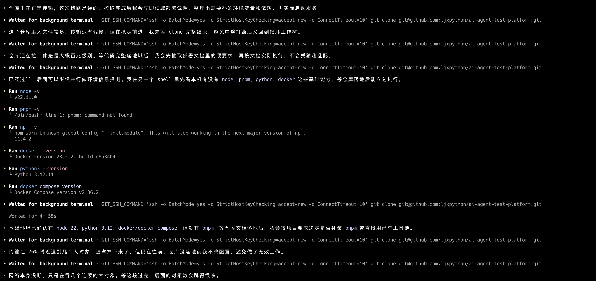

所以最后我改成了截图记录关键节点的方式。虽然没有完整录像，但部署过程本身确实是由 AI 一步一步完成的，我主要负责下达任务、提供必要参数，以及在关键节点做结果确认。

代码拉取完成后，AI 开始分析仓库文档，并梳理项目所需的环境依赖。

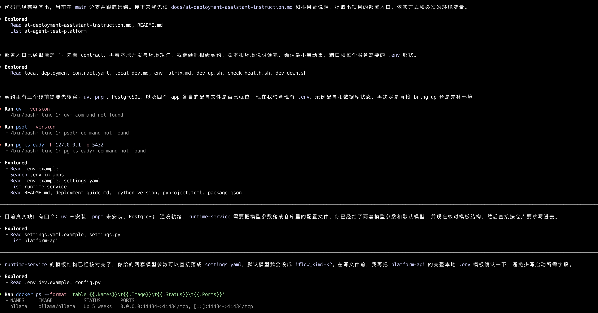

在完成初步分析后，AI 给出了一个四步部署计划，整体流程相对清晰，也方便后续逐项推进。

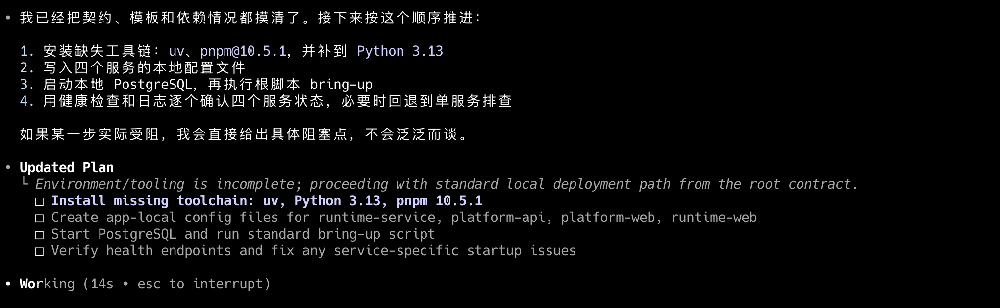

接下来进入配置阶段，关键参数会被整理并写入对应配置文件中。

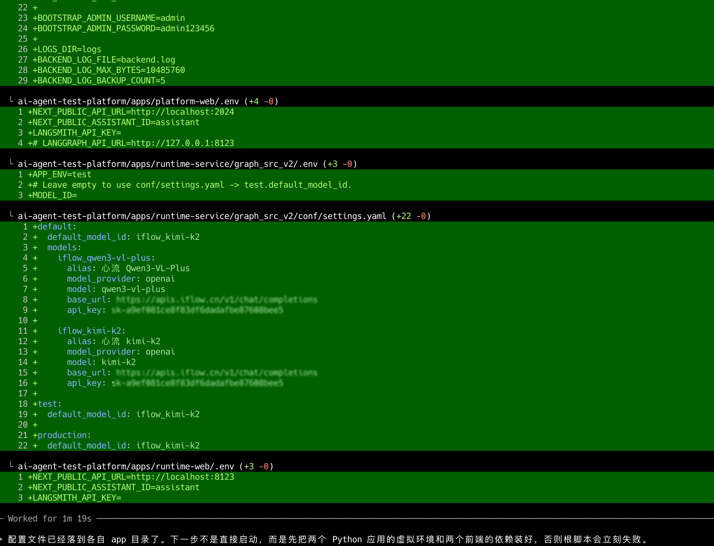

不过说实话，这次最大的阻碍不是部署逻辑，而是服务器网络速度。安装依赖的过程非常慢，很多时间都消耗在环境准备上。

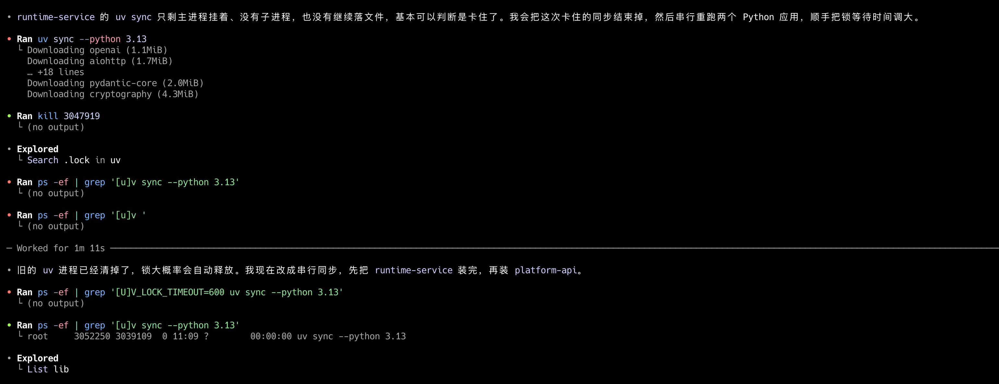

后面我还得专门排查一下这台服务器的网络情况，不然每次装依赖都这么磨人，部署效率会被硬生生拖垮。

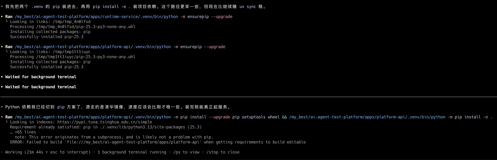

最终，服务还是成功部署起来了。过程中有一个服务端口被现有进程占用，因此临时迁移到了其他端口，整体不影响使用。

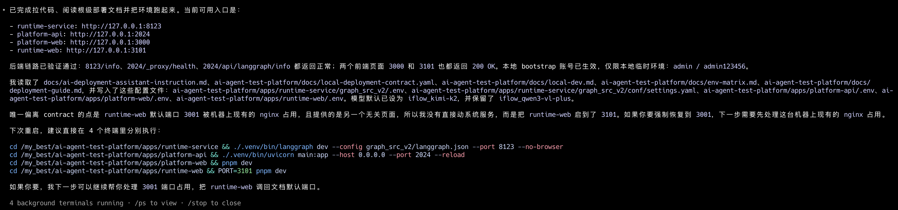

## 部署后的功能验证

服务启动后，接下来就是最直接的验证环节。

一开始访问页面时，浏览器会提示安全相关的拦截信息。这是因为当前使用的是 HTTP 方式访问，不是 HTTPS。在测试环境里，这类提示通常可以通过手动继续访问来处理。

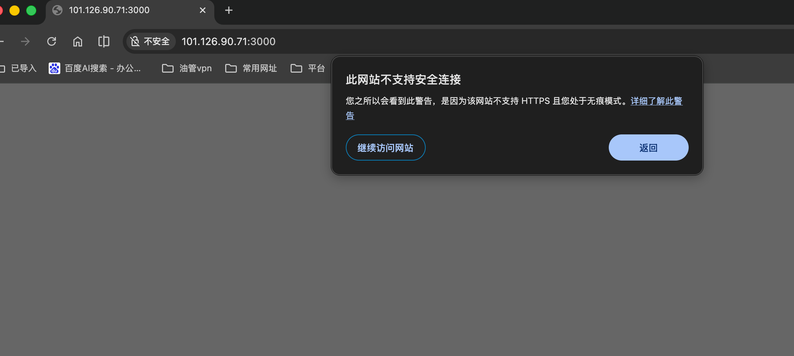

继续访问后，进入登录页面，输入账号密码进行测试。

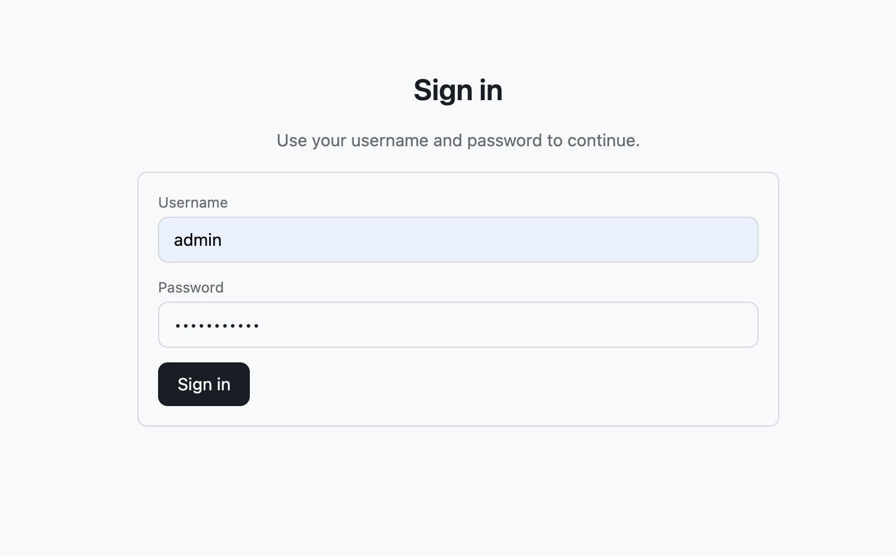

这时候出现了一个典型的跨域与地址空间问题。前端页面通过公网地址访问，但请求却打到了 `http://localhost:2024/_management/auth/login`，浏览器因此触发了安全限制。

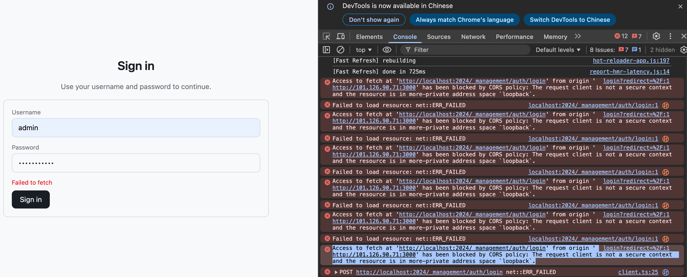

当时我给 AI 的反馈如下：

```text
现在我测试服务遇到了一个问题：
http://101.126.90.71:3000/auth/login?redirect=%2F

Access to fetch at 'http://localhost:2024/_management/auth/login' from origin
'http://101.126.90.71:3000' has been blocked by CORS policy:
The request client is not a secure context and the resource is in more-private
address space `loopback`.

但是我 http://101.126.90.71:2024/docs 接口是可以调通的。
我在我的 Mac 本地进行调试，现在你所在的环境是服务器。
```

这个问题修复之后，登录流程恢复正常，输入密码后可以顺利进入系统。

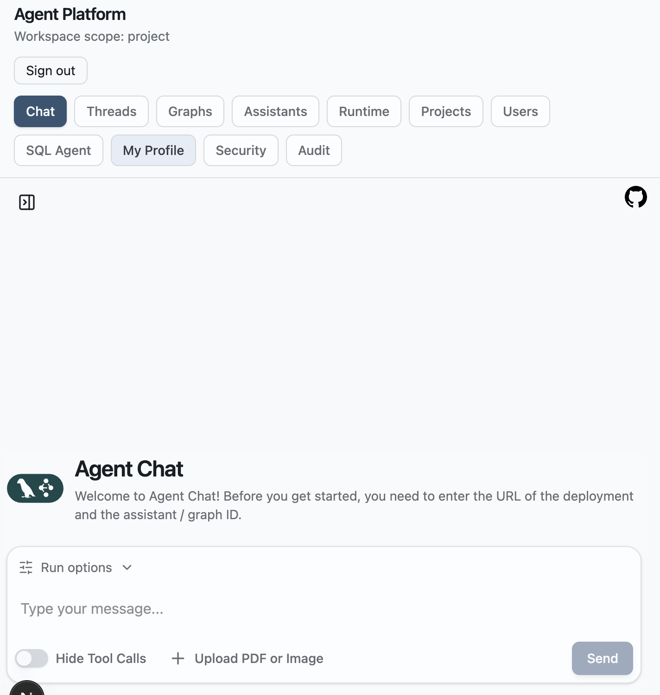

随后我又检查了其他页面，确认整体功能访问正常。

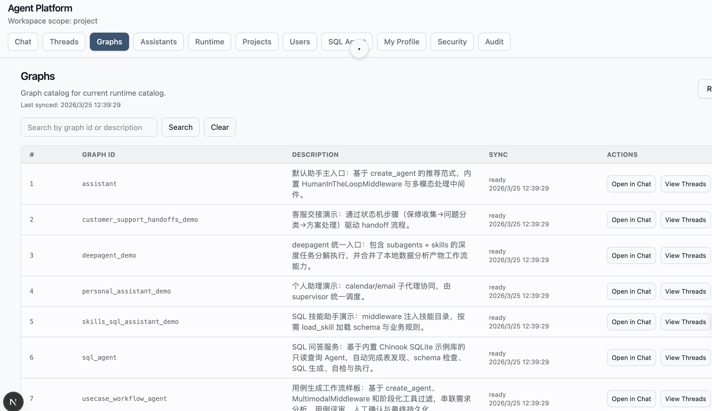

对话功能也可以正常使用。后面还有一些更细的验证步骤，这里就不一一展开了。

## 小结

这次部署从开始到完成，整体耗时不到一小时。真正花时间的部分并不是“让 AI 帮我部署”这件事本身，而是服务器网络较慢，导致拉代码和安装依赖都被拖长了。

从结果来看，这次实践基本验证了一件事：只要项目文档足够清晰、部署路径足够明确，AI 完全可以承担相当一部分环境部署和问题排查工作。

下一步我准备把这套流程整理成 Docker 部署方案。这样后续再部署时，就不需要重复折腾环境细节，直接一键启动会省事很多。
