# 企业级 AI Agent 平台前端介绍

## 一、平台概览

这篇文档主要从前端界面出发，介绍这个平台是怎么组织起来的，同时顺带说明每个页面背后依赖的后端能力。

如果只看外观，它像一个功能完整的 AI 工作台；如果顺着页面往下看，会发现它的重点并不只是聊天，而是把项目作用域、能力目录、智能体装配、对话执行、过程追踪和平台治理连成了一条完整链路。

从整体分工看，当前平台大致可以这样理解：

- `platform-web`：用户直接看到的工作台前端
- `platform-api`：负责认证、项目、用户、审计和平台管理接口
- `runtime-service`：真正执行 Graph、模型和工具调用的运行时
- `interaction-data-service`：承接结果落库与查询

下面会按照前端页面的浏览顺序来介绍平台，这样更容易看懂每个界面在整条链路中的位置。

## 二、理解界面前，先认识几个关键词

第一次接触这个项目时，最容易卡住的不是页面，而是 `Graph`、`Assistant`、`Thread` 这些名词。

这些概念并不是这个项目自己发明的，它们本身就来自 LangGraph 常见的开发范式。当前平台做的事情，更像是把这套原本偏运行时和后端的概念，翻译成一个更容易管理和使用的工作台。

为了便于理解，可以先把这些概念简单记成下面这样：

| 概念 | 通俗理解 | 在本平台中的位置 |
| --- | --- | --- |
| `Project` | 一个业务范围或工作空间 | 平台层概念，用来隔离资源和上下文 |
| `Graph` | 一种“能力蓝图”或执行流程模板 | 对应运行时能力目录 |
| `Assistant` | 基于某个 Graph 装配出来的可用智能体实例 | 面向实际使用和管理 |
| `Thread` | 一次连续对话或任务过程的上下文容器 | 用来承载历史、状态和继续执行 |
| `Run` | 在某个 Thread 上触发的一次执行 | 用户每次发消息后背后的实际运行 |
| `Runtime` | 真正负责执行 Graph 的后端引擎 | 平台背后的运行层 |

如果换一种更容易记住的说法，可以这样理解：

- `Graph` 决定“这个能力怎么跑”
- `Assistant` 决定“这个能力给谁用、默认怎么配”
- `Thread` 决定“这次会话记住了什么、现在进行到哪”

## 三、登录入口：先建立统一工作台入口

介绍这个平台时，登录页虽然不是最复杂的页面，但很适合作为起点。因为它先传递了一个清晰信号：这是一个有统一入口和身份认证的平台，而不是一个直接打开就开始聊天的临时演示页。

用户通过账号密码进入系统之后，前端会把用户带入统一工作区，而不是跳进某个孤立功能页。这个动作看起来很基础，但对于平台感很重要。

初始默认账号和密码：

`admin/admin123456`

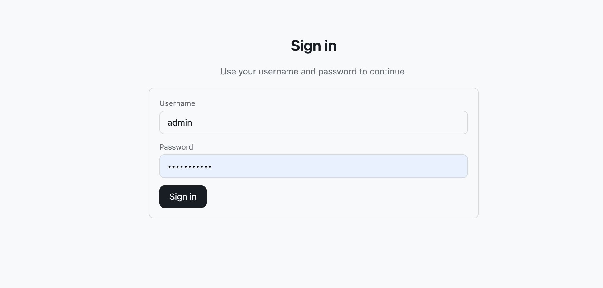

*图 1 平台登录入口。登录页负责承接统一认证流程，并将用户带入工作区。*

## 四、工作区导航：从治理到执行的一体化入口

进入工作区后，最值得先看的就是顶部导航。因为这一排导航项几乎已经把平台的核心能力范围说明白了：

- `Chat`
- `Threads`
- `Graphs`
- `Assistants`
- `Runtime`
- `Projects`
- `Users`
- `SQL Agent`
- `Security`
- `Audit`

如果用产品视角来理解，这一排导航说明了一个事实：这个前端并不是围绕单一聊天场景搭建的，而是围绕“平台工作台”来组织的。

它把资源管理、能力装配、执行入口、过程追踪和治理能力放在同一套工作区结构里，这也是它与普通 AI 对话页面最明显的区别。

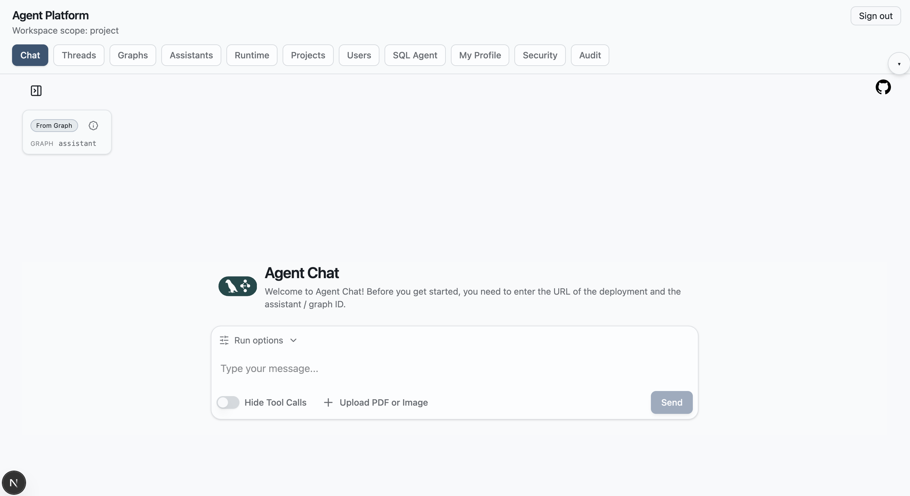

*图 2 工作区导航总览。工作区导航相当于平台能力地图，能够一眼看出系统并不只有聊天入口。*

## 五、Projects：先确定业务作用域

在当前平台中，`Project` 是一个非常关键的入口概念。

它的作用并不只是“多一个列表页”，而是先把业务范围圈定清楚。后面的 Assistant、Thread、Audit 等资源，都会自然落在项目范围内。这种设计能带来几个直接好处：

- 不同业务或团队的资源不会混在一起
- 页面状态有清晰上下文
- 后续的筛选、审计、成员管理更容易落地

因此，`Projects` 页面承担的其实是平台工作区的“边界定义”职责。只有先有项目作用域，后面的能力编排和执行链路才不会显得混乱。

从后端配合来看，这一页主要对应的是 `platform-api` 中的项目管理能力。前端在这里做的是项目作用域选择和状态承接，真正的项目数据、成员关系和权限边界则由平台后端负责。

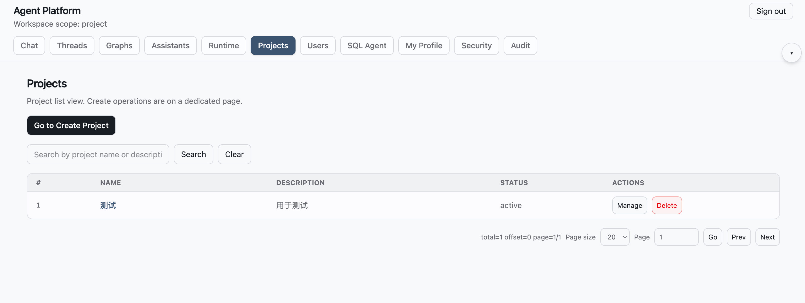

*图 3 项目管理页面。Project 用来定义业务作用域，是后续能力装配和执行的前提。*

## 六、Graphs：把运行时能力先展示出来

`Graphs` 页面可以理解成平台对运行时能力的第一层可视化表达。

在 LangGraph 的开发范式里，Graph 更像是一个执行流程或能力蓝图。它本身并不是最终交给业务用户直接使用的产品形态，但它决定了某类智能体能力“如何运行、如何编排”。

平台前端把这些 Graph 先展示出来，有两个现实意义：

1. 让平台知道当前运行时到底暴露了哪些能力。
2. 为后面的 Assistant 装配提供候选基础。

所以这一页更像是“能力模板目录”，而不是最终交付页面。它告诉使用者：平台手里现在有哪些可用的底层能力。

从后端链路来看，这一页展示的能力目录并不是前端本地写死的，而是平台通过 `platform-api` 去感知和同步 `runtime-service` 中的 Graph 能力，再以管理页形式展示出来。

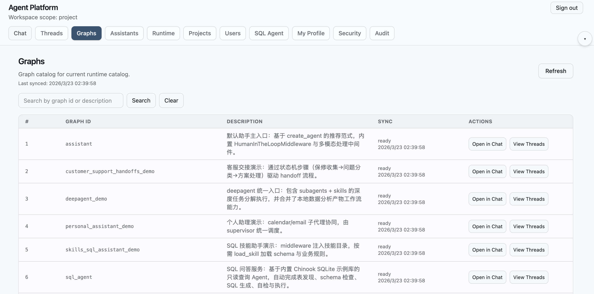

*图 4 Graph 能力目录。这里展示的是运行时可识别的能力模板，而不是最终的智能体实例。*

## 七、Create Assistant：把能力模板装配成可用智能体

如果说 `Graphs` 页面展示的是能力模板，那么 `Create Assistant` 页面就是把能力模板装配成业务可用智能体的地方。

这一步非常关键，因为它体现了当前平台前端不是只做展示，而是能够承接“装配”这件事。页面中可以完成：

- 选择 `Graph ID`
- 填写名称和描述
- 配置运行时模型
- 选择工具能力
- 设置动态参数

从 LangGraph 视角看，Assistant 可以理解为“基于某个 Graph 暴露出来、可被实际调用的实例”。而在当前平台里，这一步又进一步加入了项目作用域和平台层的管理语义，所以它既保留了官方范式的一致性，又更适合平台管理。

从后端功能看，这一页做的不是简单保存表单。前端会把配置提交给 `platform-api`，再由平台层去完成 Assistant 元数据管理、参数保存，以及与运行时能力的同步。

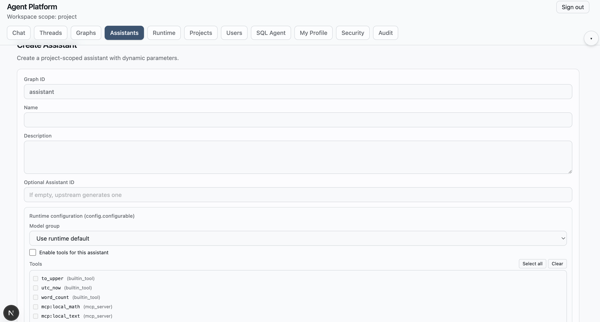

*图 5 创建 Assistant 页面。前端在这里完成从 Graph 到 Assistant 的装配过程。*

## 八、Assistants：把配置结果连接到实际运行

`Assistants` 页面承接的，是装配完成之后的管理和执行入口。

在这里，用户不仅能看到当前项目下有哪些 Assistant，还可以直接继续执行后续动作，例如：

- `Open in Chat`
- `View Threads`
- 编辑配置
- 重新同步
- 删除实例

因此，这一页的重要性在于：平台不是“创建完就结束”，而是围绕已创建的 Assistant 继续提供运行、追踪和治理能力。

从阅读体验上看，这一页会让人明显感觉到平台的资源是“活的”。Assistant 不是静态配置项，而是后续执行链路的起点。

从后端视角看，这一页把平台管理和运行时执行连接了起来。前端看到的是列表、状态和操作按钮，背后则对应 `platform-api` 对 Assistant 元数据、同步状态以及运行时实例状态的统一管理。

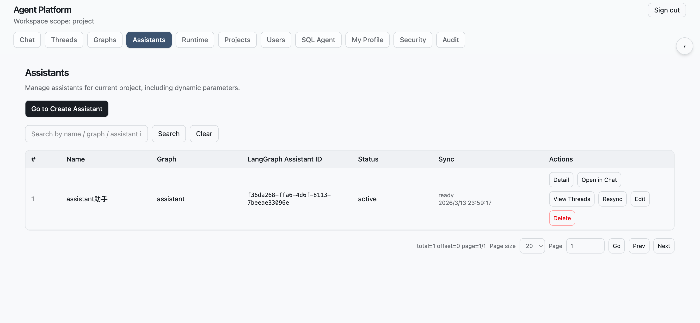

*图 6 Assistant 列表页。Assistant 既是管理对象，也是后续执行入口。*

## 九、Chat：统一交互中心

如果说前面的页面更多是在定义范围、识别能力和装配资源，那么 `Chat` 页面就是平台真正进入执行阶段的核心入口。

这一页之所以重要，并不只是因为它能对话，而是因为它承接了来自多个页面的跳转结果：

- 可以从 `Graphs` 页面带着某个 Graph 进入对话
- 可以从 `Assistants` 页面带着某个 Assistant 进入对话
- 可以从 `Threads` 页面带着某个历史 Thread 回到上下文继续执行

换句话说，`Chat` 更像是平台中的统一交互中心，而不是孤立的聊天框。

从后端链路看，这里实际上已经进入执行阶段。前端负责承接上下文、组织消息和展示结果，真正的消息流转、Graph 执行和工具调用，则由 `platform-api` 网关到 `runtime-service` 来完成。

### 9.1 上下文可见，历史可回看

当前 `Chat` 页面会明确展示当前会话所绑定的上下文信息，例如来源于哪个 Graph、哪个 Assistant、是否关联某个 Thread。这种设计很有价值，因为它让用户始终知道自己现在是在什么上下文中执行，而不是进入一个完全黑盒的对话框。

同时，聊天界面还能直接展开历史会话，从而把当前执行和过去记录连接起来。对于持续调试、复盘问题或重复利用已有上下文来说，这一点非常实用。

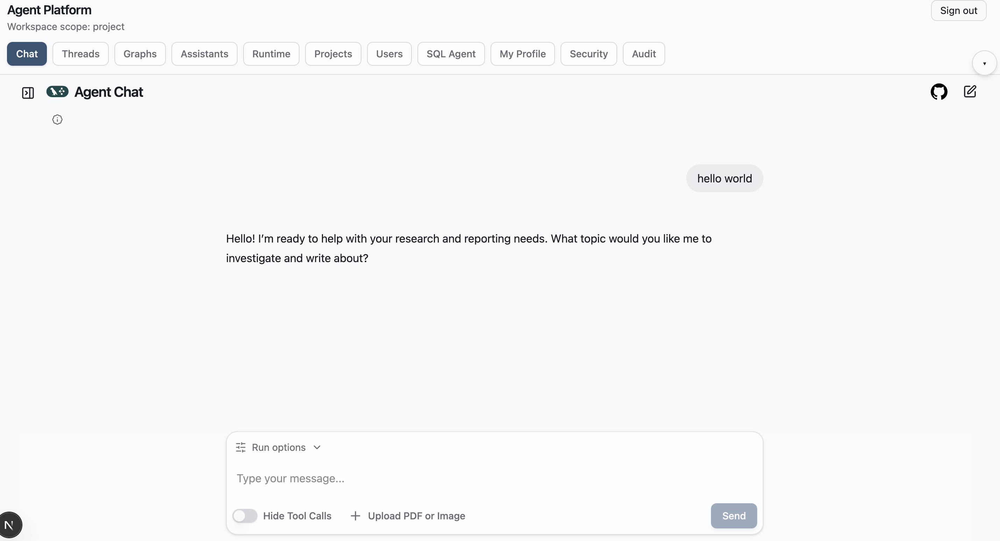

*图 7 平台 Chat 页面。Chat 页面承接来自 Graph、Assistant 和 Thread 的上下文，是统一执行入口。*

*图 8 Chat 历史会话视图。历史会话可以直接在 Chat 中查看和切换，保证上下文连续性。*

### 9.2 运行参数可以按会话临时覆盖

`Chat` 页面还有一个很值得强调的能力：它并不是只能发送消息，还允许用户在当前会话中临时调整运行参数。

目前支持按会话覆盖的内容包括：

- 模型选择
- 是否启用工具
- 工具列表
- `temperature`
- `max_tokens`

这意味着用户无需回到 Assistant 配置页，也不需要改动默认配置，就可以直接在当前会话里做调试和对比试验。这个能力非常适合研发、调优和场景验证阶段使用。

从平台设计角度看，这也体现了一个很重要的思想：前端既是执行入口，也是调试入口。

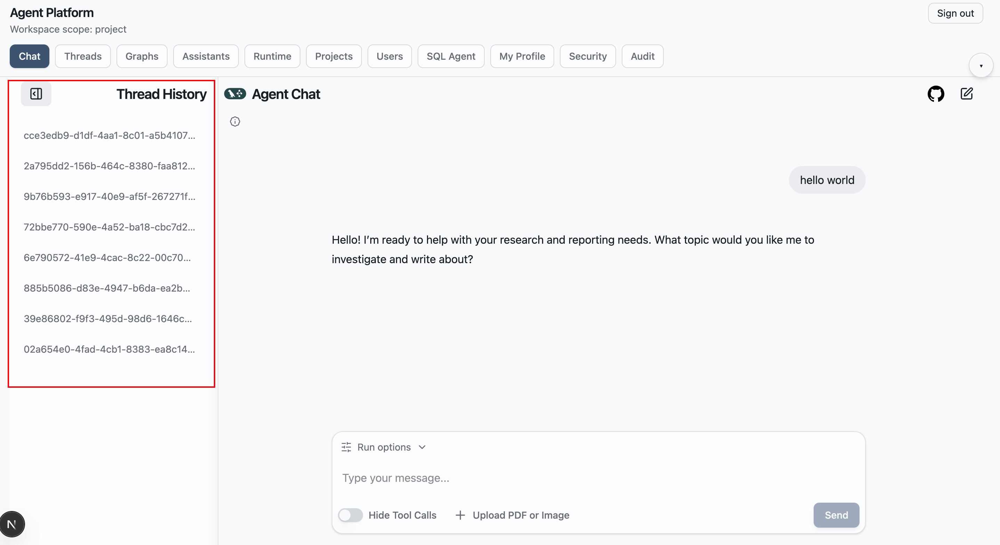

*图 9 Chat 运行参数面板。运行参数覆盖只作用于当前会话后续消息，不会直接改写 Assistant 默认配置。*

## 十、SQL Agent：独立能力页面的样板

`SQL Agent` 页面建议单独看待，而不要简单把它理解成“又一个聊天页面”。

它的真正价值在于：这是一个已经从通用聊天模板中提炼出来的专项能力页面示例。它预先绑定了特定 Graph，并为这一类场景提供了更明确的页面语义。

这说明当前平台前端并不是只能停留在一个总聊天页上，而是已经具备了一种很有扩展性的能力：

可以在统一模板基础上，继续拆分出更聚焦、更垂直的独立 Agent 页面。

对于后续扩展需求助手、客服助手、研发助手等场景，这种能力非常重要。它意味着平台既能保留统一框架，也能逐渐长出更专业的业务页面。

从后端上看，这种页面并不是重新实现一套执行逻辑，而是基于现有运行时能力做更明确的页面绑定和场景化包装，因此很适合作为未来独立 Agent 页面开发的样板。

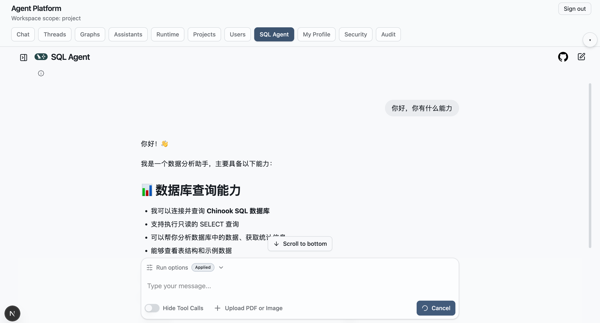

*图 10 SQL Agent 独立页面。SQL Agent 体现的是“从通用聊天模板提炼专项页面”的能力。*

## 十一、Threads：不仅看结果，也看过程

很多 AI 页面在对话结束后，剩下的只是几条消息记录；而当前平台前端在 `Threads` 页面中进一步把“过程”也展示出来了。

这页可以理解为平台的过程追踪入口。用户不仅能看到历史线程，还能基于不同条件继续筛选：

- Thread ID
- Assistant
- Graph
- 状态

在具体线程详情中，还可以看到：

- 消息预览
- 历史时间线
- 原始状态数据

这意味着平台前端并不是只负责“展示答案”，而是能够把执行过程本身纳入可追踪、可复盘、可分析的范围。对于工程化落地来说，这一点非常关键。

从后端配合来看，这一页会通过平台后端查询线程列表、线程详情、状态和历史信息，把运行时原本偏底层的数据，转换成适合平台查看和排查的问题视图。

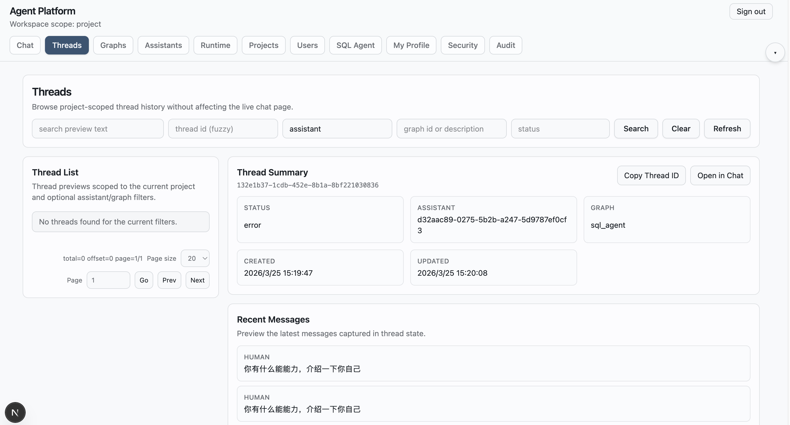

*图 11 线程历史与详情。Threads 页面让会话过程、状态和历史可被持续追踪。*

## 十二、Runtime：把能力边界明确展示出来

`Runtime` 页面负责做一件很有平台价值的事情：把当前运行时真正可用的模型和工具能力展示出来。

这页虽然不直接承接业务操作，但它有非常重要的解释作用。因为前面在创建 Assistant 或调整 Chat 运行参数时看到的模型和工具选项，并不是随意写在页面里的，而是来自运行时已经暴露出来的能力目录。

因此，`Runtime` 页面相当于平台前端的“能力边界说明书”。

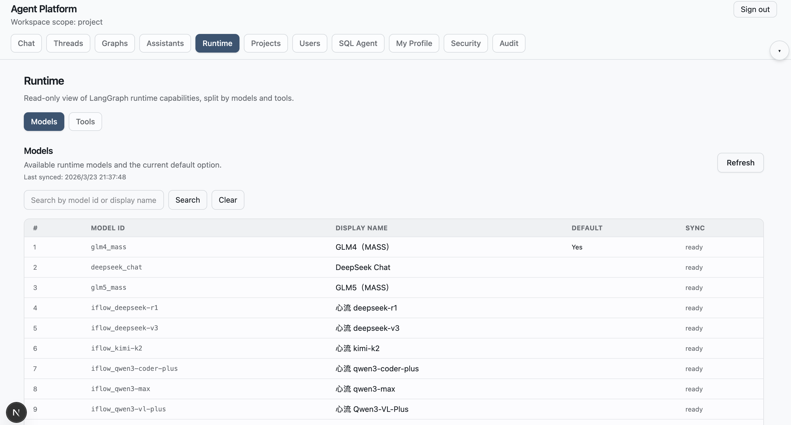

*图 12 Runtime 模型目录。这里展示当前运行时提供的模型能力及默认选项。*

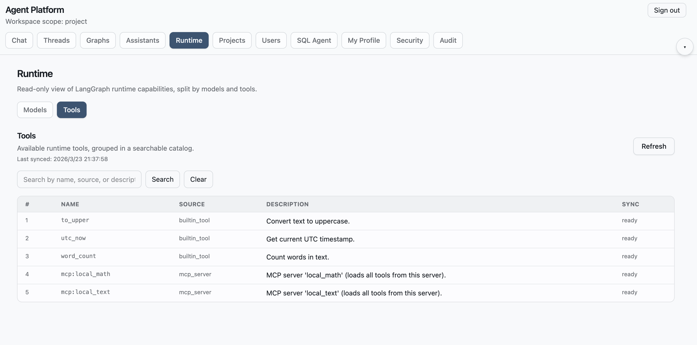

*图 13 Runtime 工具目录。这里展示当前运行时可接入的公共工具能力。*

## 十三、Audit：把平台治理闭环补齐

如果说 `Projects`、`Graphs`、`Assistants`、`Chat` 和 `Threads` 解决的是“怎么组织和执行”，那么 `Audit` 解决的就是“怎么治理和追责”。

在这一页中，平台会保留关键操作记录，并支持按照不同维度筛选，例如：

- action
- target type
- target id
- method
- status code

这使得前面发生过的创建、修改、调用和访问，不会在执行结束后消失，而是能够被回看和追踪。对于企业场景中的权限治理、问题定位和合规留痕来说，这一页是平台闭环中不可缺少的一环。

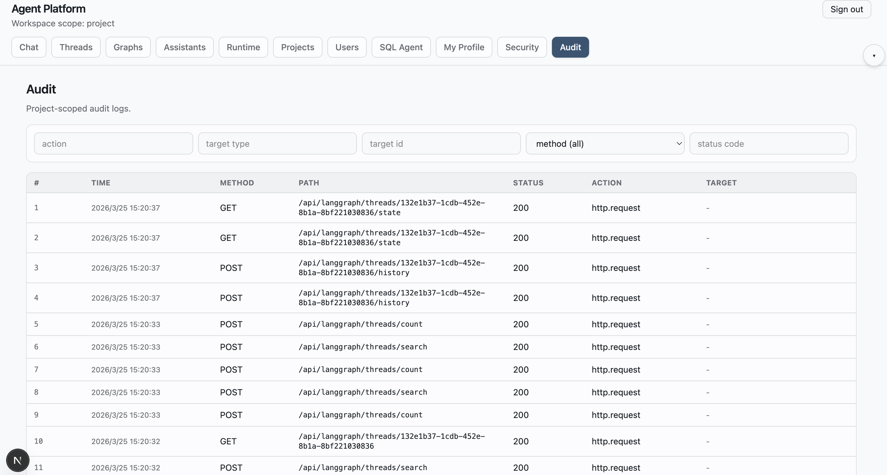

*图 14 审计日志页面。Audit 页面负责把平台操作行为结构化留痕。*

## 十四、补充：当前平台的设计思路

前面如果只按页面来理解，这个平台已经能看出一条比较清晰的工作流；再往后看一步，会发现当前前端背后还有几条很明确的设计思路。

### 14.1 平台层负责治理，运行时负责执行

这个项目并没有把所有智能体逻辑都堆进前端或平台后端。平台层更多承担的是工作台入口、项目作用域、用户管理、审计治理和能力装配入口，而真正的 Graph 执行、模型调用、工具接入和智能体行为，仍然主要放在运行时层。

这也是当前平台最核心的设计思路之一：平台负责治理和入口，运行时负责 AI 行为本身。

### 14.2 不重新发明概念，而是把官方范式做成工作台

`Graph`、`Assistant`、`Thread` 这些概念本身就来自 LangGraph 范式。当前平台没有重新发明一套术语，而是通过页面把这些概念映射成更容易操作的工作台体验。

这样做的好处是：

- 技术概念和运行时保持一致
- 学习成本更低
- 前端和后端的职责边界更清楚

### 14.3 通用入口和专项页面可以并存

当前平台既有通用 `Chat` 页面，也有 `SQL Agent` 这种专项页面示例。这说明前端结构不是只能停留在一个总聊天页上，而是已经具备继续拆分垂直 Agent 页面、逐步扩展产品形态的能力。

## 十五、总结：如何理解这个平台前端的吸引力

从单个页面看，这个平台的界面并不是靠夸张视觉来吸引人；它更有价值的地方在于，整套前端结构是连贯的。

从工作流角度看，它基本形成了这样一条主线：

`Project` 定义业务范围  
`Graph` 展示能力模板  
`Assistant` 完成能力装配  
`Chat` 作为执行入口  
`Thread` 负责过程追踪  
`Audit` 补齐治理闭环

对于初学者来说，这套设计的意义在于：它把 LangGraph 原本偏后端和运行时的开发范式，翻译成了更容易理解的平台工作台体验。

对于继续开发的人来说，这套设计的意义在于：它既没有破坏运行时范式，又把平台治理和产品入口补齐了。

## 十六、延伸阅读

如果你希望继续理解这套项目为什么要这样拆分、平台层和运行时层各自承担什么责任，建议继续阅读：

- [20260325_project_development_paradigm.md](./20260325_project_development_paradigm.md)

这篇文档会从更偏架构和开发方法的角度，继续解释当前项目的设计哲学与后续演进方式。
